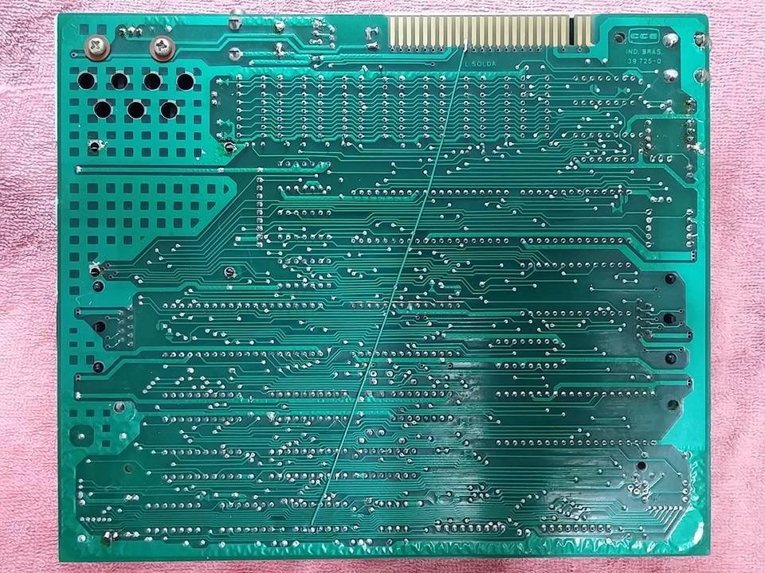

# BlueDrive

O BlueDrive foi criado pelo [Victor Trucco](http://www.victortrucco.com/) para que micros clássicos pudessem ler e gravar arquivos em pen drives. Há um vídeo demonstrando o periférico em funcionamento num MC1000 emulado numa [placa de desenvolvimento Altera DE1](https://www.altera.com/support/training/university/de1.html). Como diz o Victor no final do vídeo, "depois de quase 30 anos, finalmente o MC1000 tem um sistema armazenamento de massa".

<iframe width="480" height="270" src="https://www.youtube.com/embed/KAIPFog6Hjo" frameborder="0" allow="accelerometer; autoplay; encrypted-media; gyroscope; picture-in-picture" allowfullscreen></iframe>

Nessa primeira versão do sistema operacional do BlueDrive, os comandos disponíveis são:

* `LOAD $` — Lista diretório atual.
* `TLOAD "ARQUIVO.BIN` — Carrega e executa programa em linguagem de máquina.
* `LOAD "ARQUIVO.BAS` — Carrega programa em BASIC.
* `SAVE "ARQUIVO.BAS` — Salva programa em BASIC.
* `LOAD "SUBDIR` — Muda para subdiretório.
* `LOAD "*` — Muda para diretório raiz.

O formato de arquivo utilizado pelo BlueDrive é o dos arquivos .CAS gerados pelo [utilitário para cassete](cassete) **MC1000CasTools**: um cabeçalho (composto de nome, endereço de início e endereço de fim) seguido dos dados propriamente ditos. (Uma versão anterior da ferramente gerava esses arquivos com extensão .BIN.)

A implementação dos novos comandos envolve fornecer no periférico uma versão modificada da ROM, onde se examina se o primeiro caracter após um comando `SAVE`/`LOAD`/`TLOAD` é o caracter dólar ou aspas, executando as rotinas apropriadas em caso afirmativo, ou as rotinas originais para cassete em caso negativo.

O primeiro lote de periféricos para o micro real foi produzido em novembro de 2015.

## Modificação de hardware necessária

Para funcionar corretamente o BlueDrive precisa de um sinal produzido na placa-mãe que **não** é disponibilizado pela [porta de expansão](porta_de_expansao) do MC1000 — o sinal que faz com que o Z80 acesse a ROM a partir do endereço $0000 no momento da inicialização, embora ela normalmente só esteja acessível a partir de $C000. Então é necessário fazer uma intervenção no MC1000: Soldar um fio elétrico por baixo da placa-mãe ligando o pino 5 do chip U29 (SN74LS125AN) com o pino 35 da porta de expansão, que vem de fábrica não conectado, conforme a figura abaixo:

## Novos comandos para uma versão futura

Os comandos da versão inicial do sistema operacional do BlueDrive são suficientes para utilizar o software disponível hoje para o MC1000. Mas para uma utilização mais "profissional", seria interessante poder carregar blocos avulsos de memória, por exemplo, para se carregar sprites e fases de um jogo a partir do programa em execução.
Há [uma postagem no *Locutório de Ensjo*](http://ensjo.blogspot.com/2015/06/comandos-para-bluedrive.html) (blog pessoal de Emerson Costa) dedicada ao desenvolvimento de novos comandos para uma versão futura do sistema. Quem tiver sugestões a fazer pode usar o formulário de comentários do blog.

## Informações adicionais

* O BlueDrive não reconhece a troca de pen drives.
* O MC1000 com BlueDrive só inicializa se houver um pen drive encaixado. Se não, ficará esperando.
* O slot de cartão SD ao lado do BlueDrive atualmente não tem nenhuma função. Dependeria de reescrever o sistema operacional.
* O pen drive deve ser formatado com uma partição FAT16 sem flags, sem *Master Boot Record* (MBR). Windows 7 até suporta FAT16, mas não formata. Uma alternativa é particionar o pen drive no Linux com [GParted (GNOME Partition Editor)](http://gparted.org). Convém lembrar que o tamanho de uma partição FAT16 é 4GB. Outro programa é o [EaseUS Partition Master](http://www.partition-tool.com).
