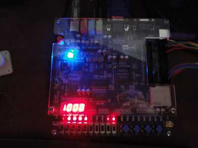
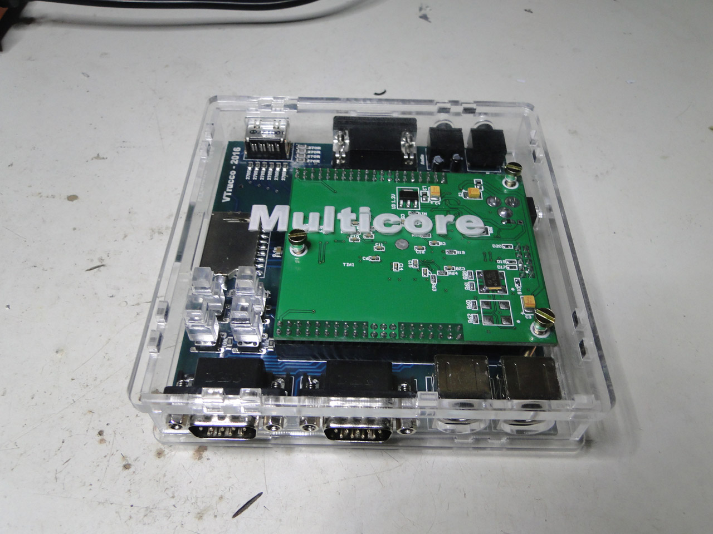
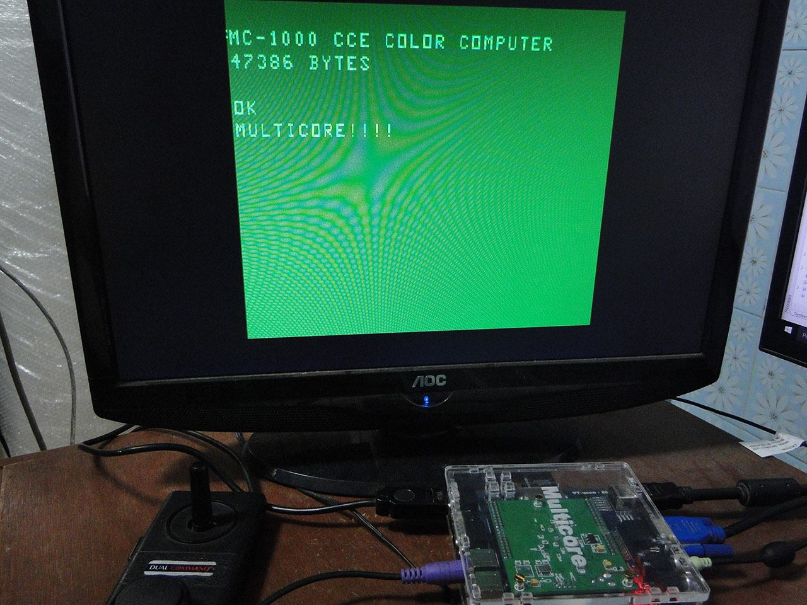

# Clones

## Altera DE1

Em outubro de 2014 o [Victor Trucco](http://www.victortrucco.com) divulgou um [clone do MC1000](http://www.victortrucco.com/Diversos/MC1000/MC1000.asp) implementado em FPGA, na [placa de desenvolvimento DE1 da Altera](http://www.altera.com/education/univ/materials/boards/de1/unv-de1-board.html). O clone em sua versão 1.1 já implementava chaveamento entre 16 e 64KiB de RAM e chaveamento da [mod](https://sites.google.com/site/ccemc1000/hardware/mods) de blocos coloridos no modo texto. Na 1.2 foram acrescentados a leitura de cassete e o monitor de 80 colunas baseado em MC6845.

<iframe width="560" height="315" src="https://www.youtube.com/embed/sm8gyzDcPKI" frameborder="0" allow="accelerometer; autoplay; encrypted-media; gyroscope; picture-in-picture" allowfullscreen></iframe>

<iframe width="560" height="315" src="https://www.youtube.com/embed/oX9lLewuOLc" frameborder="0" allow="accelerometer; autoplay; encrypted-media; gyroscope; picture-in-picture" allowfullscreen></iframe>

## Altera DE2

Em 2016 o [Lisias Toledo](http://retro.lisias.net/) elaborou a versão para a placa DE2.

Ambas as versões estão disponíveis em <https://bitbucket.org/lst_retro/mc1000-fpga>.

## Multicore

Em 5 e 6 de dezembro de 2016 o Victor Trucco fez publicações no grupo sobre o MC1000 ([1](https://www.facebook.com/groups/mc1000/permalink/1341343622583820/), [2](https://www.facebook.com/groups/mc1000/permalink/1341909255860590/), [3](https://www.facebook.com/groups/mc1000/permalink/1342484545803061/)) anunciando a inclusão do MC1000 entre os diversos equipamentos sintetizados em seu projeto [Multicore](http://www.victortrucco.com/Multicore/Multicore).

Eis uma notícia sobre o Multicore no sítio Old Players: [Várias plataformas, um único equipamento!???](http://oldplayers.com.br/wp/2016/12/05/varias-plataformas-um-unico-equipamento/).