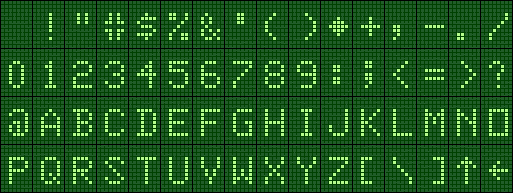

# Conjunto de caracteres

O modo texto do chip MC6847 do MC1000 oferece nativamente uma gama limitada de 64 caracteres:

É notável que o MC6847 não tenha letras minúsculas. E os dois últimos caracteres — seta para cima (↑), seta para a esquerda (←) — divergem do padrão ASCII usual — circunflexo (^), sublinhado (_) —. Essas divergências se devem ao fato de o MC6847 utilizar **uma versão precoce do ASCII** (X3.4-1963). As letras minúsculas e outras modificações foram introduzidas no padrão alguns meses depois.

American Standard Code for Information Interchange (X3.4-1963), 17 de junho de 1963.  
(<http://www.transbay.net/~enf/ascii/ascii.pdf>, página 22)

|     |   0  |  1  |  2  |  3  |  4  |  5  |   6  |   7  |  8  |   9   |  A  |   B  |  C  |  D  |  E  |  F  |
| :-: | :--: | :-: | :-: | :-: | :-: | :-: |  :-: | :--: | :-: | :---: | :-: | :--: | :-: | :-: | :-: | :-: |
|  0_ | null | som | eoa | eom | eot | wru |  ru  | bell | fe0 | ht/sk |  lf | vtab |  ff |  cr |  so |  si |
|  1_ |  dc0 | dc1 | dc2 | dc3 | dc4 | err | sync |  lem |  s0 |   s1  |  s2 |  s3  |  s4 |  s5 |  s6 |  s7 |
|  2_ |  spc |  !  |  "  |  #  |  $  |  %  |   &  |   '  |  (  |   )   |  *  |   +  |  ,  |  -  |  .  |  /  |
|  3_ |   0  |  1  |  2  |  3  |  4  |  5  |   6  |   7  |  8  |   9   |  :  |   ;  |  <  |  =  |  >  |  ?  |
|  4_ |   @  |  A  |  B  |  C  |  D  |  E  |   F  |   G  |  H  |   I   |  J  |   K  |  L  |  M  |  N  |  O  |
|  5_ |   P  |  Q  |  R  |  S  |  T  |  U  |   V  |   W  |  X  |   Y   |  Z  |   [  |  \  |  ]  |  ↑  |  ←  |
|  6_ |      |     |     |     |     |     |      |      |     |       |     |      |     |     |     |     |
|  7_ |      |     |     |     |     |     |      |      |     |       |     |      | ack |     | esc | del |

O MC6847 oferece a possibilidade de obter desenhos de outros caracteres a partir de uma memória externa, mas o MC1000 não usa esse recurso.