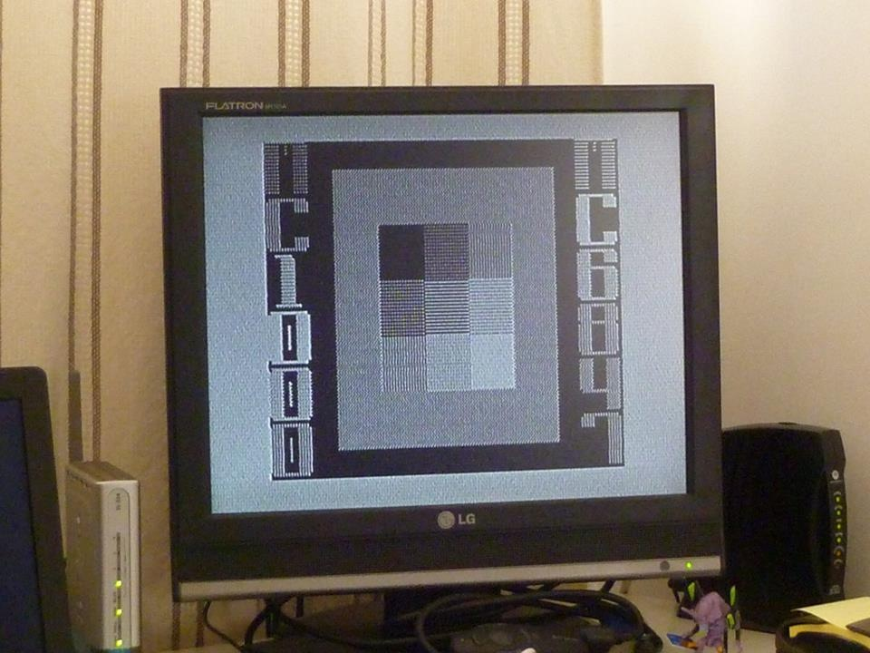
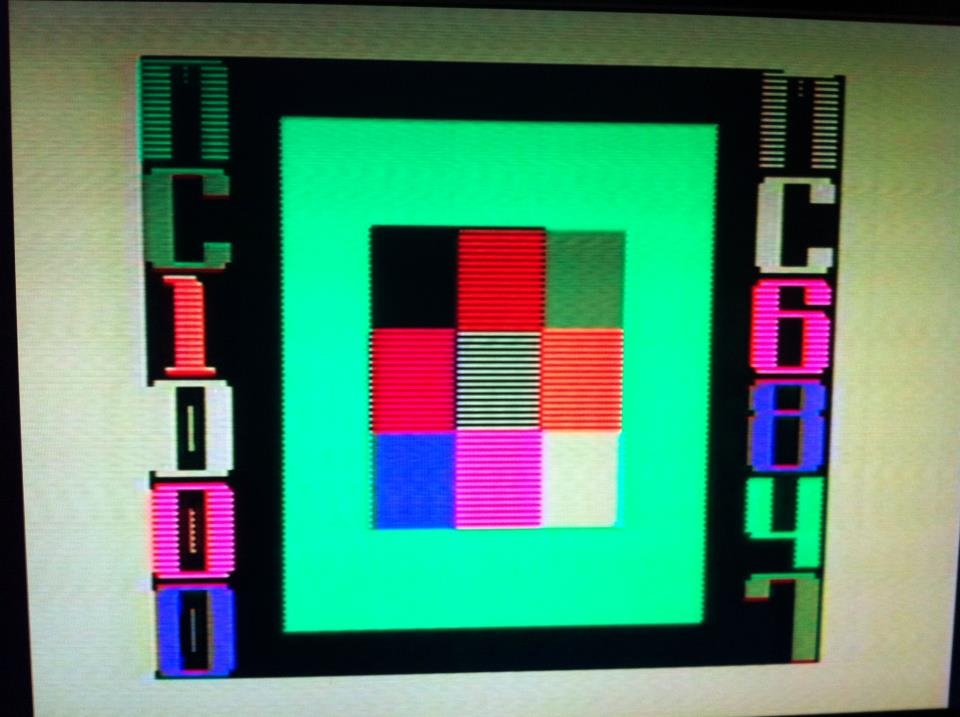
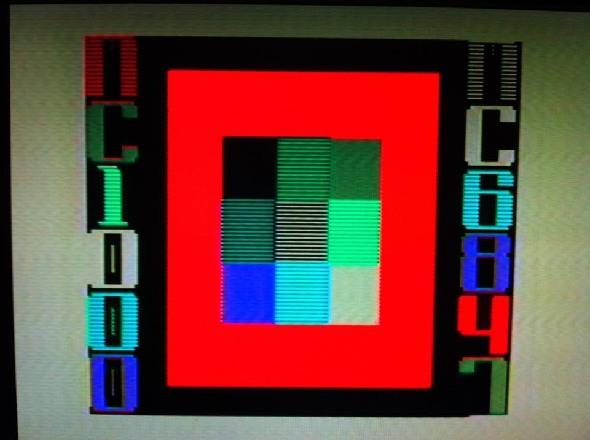
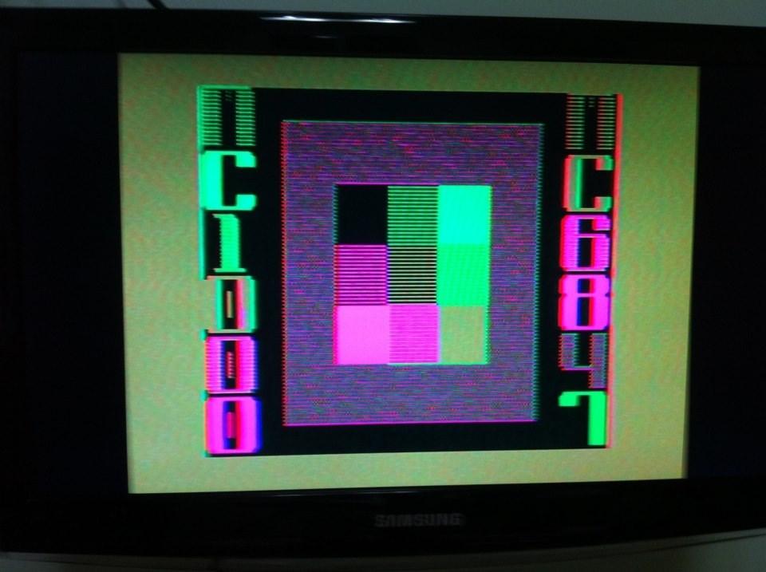
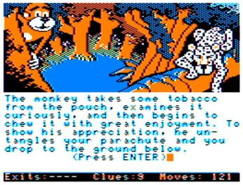

# Cores

O chip de vídeo MC6847 do MC1000 produz imagens coloridas por meio de três sinais, Y (luminância), ϕA e ϕB (crominância) ([Y′UV](http://en.wikipedia.org/wiki/YUV)), que são depois combinados pelo circuito gerador de RF. Utiliza-se quatro níveis de Y e três níveis de ϕA e ϕB para compor as cores.

A fórmula para converter Y′UV para RGB é:
*   R = Y′ + 1,13983 × U
*   G = Y′ − 0,39465 × U − 0,58060 × V
*   B = Y′ + 2,03211 × V

Assumindo os sinais Y′UV numa escala de 0 a 255, temos a seguinte tabela de conversão:

|        Cor        |  Y  |  ϕA  |  ϕB  |   R  |  G  |   B  | RGB hex(*) |
| :---------------: | --: | ---: | ---: | ---: | --: | ---: | :--------: |
|       Verde       | 153 | −128 | −128 |    7 | 277 | −107 |   #07ff00  |
|      Amarelo      | 255 | −128 |    0 |  255 | 305 |   −5 |   #ffff00  |
|        Azul       |  59 | +128 |    0 |   59 |   8 |  319 |   #3b08ff  |
|      Vermelho     |  59 |    0 | +128 |  204 | −15 |   59 |   #cc003b  |
| Branco ("*buff*") | 255 |    0 |    0 |  255 | 255 |  255 |   #ffffff  |
|       Ciano       | 153 |    0 | −128 |    7 | 227 |  153 |   #07e399  |
|      Magenta      | 153 | +128 | +128 |  298 |  28 |  413 |   #ff1cff  |
|      Laranja      | 153 | −128 | +128 |  298 | 129 | −107 |   #ff8100  |
|       Preto       |   0 |    0 |    0 |    0 |   0 |    0 |   #000000  |
|    Verde escuro   |   0 | −128 | −128 | −145 | 124 | −260 |   #007c00  |
|  Vermelho escuro  |   0 | −128 | +128 |  145 | −23 | −260 |   #910000  |

(*) Valores de R, G e B abaixo de zero ou acima de 255 nas colunas anteriores foram cortados para ficar dentro do intervalo válido.

As oito primeiras cores aparecem consistentemente nos modos de vídeo gráficos e semigráficos do MC6847. As três últimas têm aparições mais restritas:

*   O **preto** é cor de borda nos modos de texto (*Alphanumeric*); é cor de fundo e de borda nos modos semigráficos (*Semigraphics*); e é cor associada ao bit zero nos modos gráficos de duas cores (*Resolution Graphics*) onde a cor de frente é branca (CSS = 1), como no modo `HGR`.
*   O **verde escuro** é a cor de fundo no modo de texto (*Alphanumeric*) onde a cor de frente é verde (CSS = 0); e é cor associada ao bit zero nos modos gráficos de duas cores (*Resolution Graphics*) onde a cor de frente é verde (CSS = 0).
*   O **vermelho escuro** é a cor de fundo no modo de texto (*Alphanumeric*) onde a cor de frente é laranja (CSS = 1).

* * *

## Cores "fantasmas" (*color artifacting*)

Os sinais de RF e vídeo composto combinam as informações de luminância (intensidade de luz) e crominância (cor) em um único sinal, usando diferentes frequências para distingui-los. O sinal de luminância usa frequências baixas e o sinal de crominância usa frequências altas, e assim podem ser separados pelo televisor. Porém, se em uma imagem o sinal de luminância se alterna muito rapidamente (como um estreito ponto preto entre pontos brancos, ou vice-versa), ele pode acabar sendo confundido com um sinal de crominância, produzindo cores onde não deveria haver. Isso ocorre no MC1000 principalmente no modo `HGR` (o modo *Resolution Graphics 6* do MC6847), embora o fenômeno também se manifeste como manchas avermelhadas nas letras no modo `TEXT`.

Eis abaixo uma imagem formada por padrões de pontos no modo`HGR`, e as cores fantasmas geradas por color artifacting em um televisor colorido:





Note-se que no MC1000, que produz cor para o televisor no padrão PAL-M, a posição vertical influencia nas cores. A imagem acima, erguida 1 pixel vertical na tela, passa a apresentar as seguintes cores:



A mod de vídeo composto para o MC1000 produz cor no padrão NTSC, e faz com que o televisor produza *color artifacting* com magenta e verde, independentemente da posição vertical:



Esse efeito, a princípio indesejável, foi bem aproveitado pelos desenvolvedores de jogos para o TRS-80 Color Computer, onde ele produz consistentemente azul e vermelho além do preto e do branco, o que resulta numa paleta de quatro cores mais interessante do que as paletas de 4 cores oferecidas nativamente pelo MC6847 (verde-amarelo-azul-vermelho ou branco-ciano-magenta-laranja):



O  ["Service Manual: TRS-80 Color Computer 2 NTSC Version" (26-3124/3136) da Radio Shack](http://www.colorcomputerarchive.com/coco/Documents/Manuals/Hardware/Color%20Computer%202%20Service%20Manual%20(Tandy).pdf) explica que é preciso um circuito para ajustar o verde e magenta para azul e vermelho. Traduzido do inglês, páginas 32–33.

> **4.5 Artifacting**
> 
> A combinação de componentes Motorola MC6847/MC1372 é projetada para produzir vários modos de operação gráfica. O modo de mais alta resolução (192 por 256 pixels) é projetado para ser um modo preto e branco. Neste modo, a combinação de componentes MC6847/MC1372 não produz o sinal de color burst necessário para fazer o televisor "ver" cor.
> 
> O artifacting é um fenômeno no qual um televisor colorido pode produzir cor a partir de um sinal essencialmente em preto e branco, se o período do sinal for menor do que o do sinal do oscilador de cor. Entretanto, para que o televisor faça isso, ele deve receber o sinal de color burst.
> 
> O circuito de artifacting no Color Computer 2 força o Motorola MC1372 a gerar o sinal de burst no modo de alta resolução, contrariamente ao projeto original do componente. Além disso, a fase de burst gerada é controlada em um grau limitado a fim de produzir um conjunto desejado de cores ou matizes, a partir do sinal em preto e branco que agora está sendo interpretado como cor.
> 
> O sinal Color Burst consiste de aproximadamente oito ciclos de 3,58 MHz montado no back porch do pedestal da sincronização horizontal. No televisor, este sinal é usado para sincronizar o oscilador de croma interno do aparelho tanto frequência quanto em fase com o sinal transmitido, de modo que as cores apropriadas sejam demoduladas. A fase dos sinais de croma com referência a este sinal determina as matizes das cores na tela. Adicionalmente, a ausência deste sinal de burst dispara um circuito "matador de cor" no televisor, que desliga os amplificadores de banda passante de croma no aparelho. O propósito disto é que programas em preto e branco sejam vistos sem "neve" colorida, que é ruído aleatório amplificado pelos amplificadores de banda passante de croma. Sem burst recebido pelo televisor, o matador de cor deveria assegurar que o aparelho produza uma imagem em preto e branco.
> 
> As cores produzidas no modo de artifacting dependem da fase do sinal que está sendo interpretado pelo televisor como burst. É possível forçar o MC6847 (IC8) a entrar em um dos modos coloridos durante o intervalo de sincronização horizontal e assim fazê-lo enviar ao MC1372 o sinal que o faz gerar burst, retornando ao modo correto antes de que o display esteja ativo. Entretanto, se esta abordagem for usada, o burst gerado pelo MC1372 fará com que o televisor reproduza as "cores livres" como magenta e verde, o que não é aceitável.
> 
> O problema aparente neste ponto é como fazer o MC1372 produzir uma fase do sinal de burst que produza vermelho e azul. O MC1372 tem duas entradas de "fase de cor", Phase A e Phase B. Essencialmente, estas são entradas para moduladores equilibrados, cada um dos quais é referenciado a um sinal de Chroma Bias. A outra entrada para cada modulador equilibrado é uma fase do clock de 3,58 MHz, com Phase A {lagging} Phase B por cerca de 100 graus. Isto permite que mudanças nas entradas Phase A e Phase B determinem a matiz da saída de croma composta. O modo como o MC6847 faz o MC1372 gerar burst é desequilibrando a entrada Phase B em uma direção negativa durante o período de back porch. Entretanto, desequilibrar Phase A em uma direção negativa produz as cores desejadas.
> 
> É importante que o desequilíbrio deste sinal seja realizado durante o período de back porch e que o sinal Phase A possa retornar ao seu nível normal (estável) antes do período de vídeo ativo para o escaneamento. O circuito da Figura 4-8 realiza isto. Se GM0 estiver alto, então permite-se que o pulso de sincronização horizontal dispare o {one-shot}. Isto liga o transistor (Q2) por uma duração de cerca de 10 microssegundos, desde que o diodo (D13) esteja {reverse biased} (o que estará, se CSS for alto). Quando o transistor conduzir, ele desequilibrará a entrada Phase A para o MC1372 na direção negativa, fazendo-o gerar burst. Note que tanto GM0 quanto CSS devem estar altos a fim de forçar qualquer mudança no sinal de entrada de Phase A. Isto ocorre quando se está no modo de alta resolução. Em todos os outros momentos, o transistor está desligado, seu vazamento é desprezível, e portanto R9 está essencialmente conectado a nada.
> 
> ```
>                   +5V
>                    ^
>                   /_\                             Css
>                    |                               V
>                    |                               |
>              .-----*-----.          .----.         |
>              |     |     |          |    |         |
>              |     |     \          |    |         |
>          C24---    |     /R10       |   ---C26     |
>      0.033uF---    |     \9.1KOhm   |   ---.001uF  |
>              |     |     /          |    |         |
>              |     |     |          |    |         |
>            -----   |     *----------*  -----       |
>             ---    |     |          |   ---        |
>              -  Vcc|8   6|THRESHOLD |    -         |
>                  .---------.        |             ---D13
>             RESET|         |7       |              ^ 1KF20-4        R9
> GM0 >------------|         |--------'             /_\              1KOhm
>                 4|         |DISCHARGE              |          .---/\/\/\/---> TO PHASE A
>                  |   555   |             R6        |         /
>              TRIG|         |OUTPUT    4.7KOhm      |       |/
> /HS >------------|         |----------/\/\/\/------*-------|
>                 2|         |3                            Q2|\
>                  '---------'                         2N3904  V
>                 GND|1   5|CONT                                '
>                    |     |                                    |
>                    |    ---C27                                |
>                    |    ---0.022uF                          -----
>                    |     |                                   ---
>                    *-----'                                    -
>                    |
>                  -----
>                   ---
>                    -
> ```
> 
> Figura 4-8. Circuitaria de Artifacting do Color Computer 2