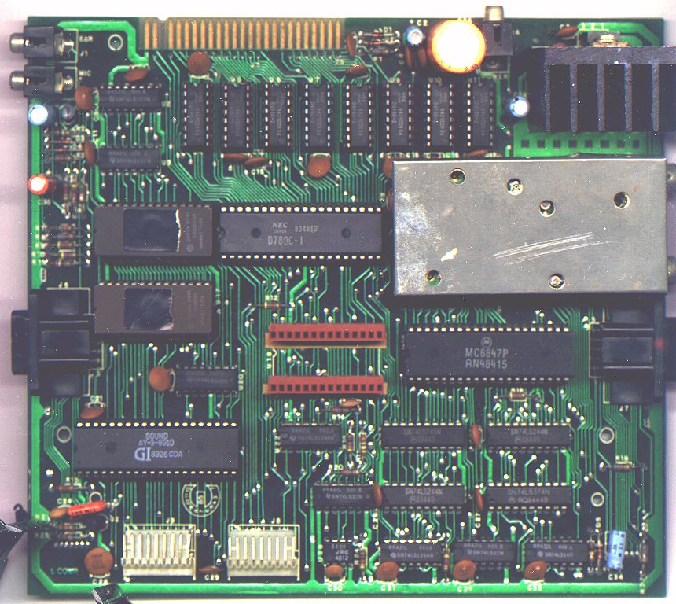

# Hardware

Há um [arquivo PDF no sítio Datassette.org](https://datassette.org/tech/diversos/cce-esquemas-eletricos-linha-completa-de-informatica) com os esquemas elétricos e chapeados de produtos de Informática da CCE, entre eles o MC1000. Está disponível em duas resoluções: 144dpi e 600dpi. Além desses, há [outros arquivos](https://datassette.org/tech/cce-mc1000) com qualidade muito pior, mas que têm a curiosidade de conter legendas e tábuas de revisão que estão ausentes no PDF anterior.

## Placa-mãe

### Circuitos integrados

 *   **U1**  
    [UA7805UC](http://www.datasheetcatalog.com/datasheets_pdf/U/A/7/8/UA7805.shtml) (5V, 1.5A fixed positive voltage regulator)  
    F 8229  
    KOREA
*   **U2, U3**  
    BRAZIL 441E  
    (*texas*) [SN74LS157N](http://www.datasheetcatalog.com/datasheets_pdf/S/N/7/4/SN74LS157N.shtml) (quadruple 2-line to 1-line data selector/multiplexer)
*   **U4, U5, U6, U7, U8, U9, U10, U11 (RAM, 16KiB)**    
    NEC JAPAN  
    8342D5018  
    [D416C-2](http://www.datasheetcatalog.com/datasheets_pdf/U/P/D/4/UPD416.shtml) (16384 x 1 bit dynamic NMOS RAM 200ns)
*   **U12 (ROM, segunda metade, 8KiB)**  
    JAPAN 8440  
    T0009SS0  
    [HN482764G](http://www.datasheetcatalog.com/datasheets_pdf/M/2/7/6/M2764A.shtml)
*   **U13 (CPU)**  
    NEC JAPAN  
    8349X5  
    [D780C-1](http://www.datasheetcatalog.com/datasheets_pdf/U/P/D/7/UPD780C.shtml)
*   **U14**  
    BRAZIL 445 A  
    (*texas*) [SN74LS74AN](http://www.datasheetcatalog.com/datasheets_pdf/S/N/7/4/SN74LS74AN.shtml) (Dual D-type pos.-edge-triggered flip-flops with preset and clear)
*   **U15**  
    BRAZIL 445 B  
    (*texas*) [SN74LS08N](http://www.datasheetcatalog.com/datasheets_pdf/S/N/7/4/SN74LS08N.shtml) (Quadruple 2-Input Positive-AND Gates)
*   **U16**  
    BRAZIL 445 D
    (*texas*) [SN74LS00N](http://www.datasheetcatalog.com/datasheets_pdf/S/N/7/4/SN74LS00N.shtml) (Quad 2-input positive-NAND gates)
*   **U17 (ROM, primeira metade, 8KiB)**  
    [M5L2764K](http://www.datasheetcatalog.com/datasheets_pdf/M/2/7/6/M2764A.shtml)  
    843126  
    (*mitsubishi*) JAPAN
*   **U18 (VRAM, 6KiB)**  
    É na realidade implementado por uma placa suspensa contendo três chips:
    *   JAPAN 4H3 D  
        [HM6116P-3](http://www.datasheetcatalog.com/datasheets_pdf/H/M/6/1/HM6116P-3.shtml) (2048-word X 8bit high speed CMOS static RAM)
*   **U19 (VDG)**  
    (*motorola*)  
    MC6847P (video display generator)  
    AN48224
*   **U20**  
    BRAZIL 449 B  
    (*texas*) [SN74LS138N](http://www.datasheetcatalog.com/datasheets_pdf/S/N/7/4/SN74LS138N.shtml) (3-line to 8-line decoder / demultiplexer)
*   **U21 (PSG)**  
    SOUND  
    [AY-3-8910](http://www.datasheetcatalog.com/datasheets_pdf/A/Y/-/3/AY-3-8910.shtml) (programmable sound generator)  
    GI 8327CDA
*   **U22**  
    [74LS139](http://www.datasheetcatalog.com/datasheets_pdf/7/4/L/S/74LS139.shtml) (dual 2-line-to-4-line decoder/demultiplexer)
    3.90
*   **U23, U24**  
    [SN74LS245N](http://www.datasheetcatalog.com/datasheets_pdf/S/N/7/4/SN74LS245N.shtml) (octal bus transceiver)  
    (*motorola*) RQ8415B
*   **U25, U30**  
    BRAZIL 436 B  
    (*texas*) [SN74LS32N](http://www.datasheetcatalog.com/datasheets_pdf/S/N/7/4/SN74LS32N.shtml) (quad 2-input positive-OR gates)
*   **U26**  
    [SN74LS244N](http://www.datasheetcatalog.com/datasheets_pdf/S/N/7/4/SN74LS244N.shtml) (octal buffer/line driver with 3-state outputs)
    (*motorola*) RQ8423N
*   **U27**  
    84C2D1  
    (*mitsubishi*) [M74LS374P](http://www.datasheetcatalog.com/datasheets_pdf/D/M/7/4/DM74LS374.shtml) (3-state octal D-type transparent latches and edge-triggered flip-flop.
*    **U28**  
    [NE555P](http://www.datasheetcatalog.com/datasheets_pdf/N/E/5/5/NE555P.shtml) (single precision timer)  
    J349A  
    (*texas*)  
    (Conectado como um oscilador [astável](http://www.kpsec.freeuk.com/555timer.htm#astable) ao pino ~INT do Z80 para produzir as interrupções RST $38.)
*   **U29**
    BRAZIL 449 B  
    (*texas*) [SN74LS125AN](http://www.datasheetcatalog.com/datasheets_pdf/S/N/7/4/SN74LS125AN.shtml) (quadruple bus buffer with 3-state outputs)
*   **U31**  
    BRAZIL 501 B  
    (*texas*) [SN74LS14N](http://www.datasheetcatalog.com/datasheets_pdf/S/N/7/4/SN74LS14N.shtml) (hex schmitt-trigger inverter)

### Outras fotos

