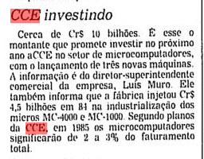
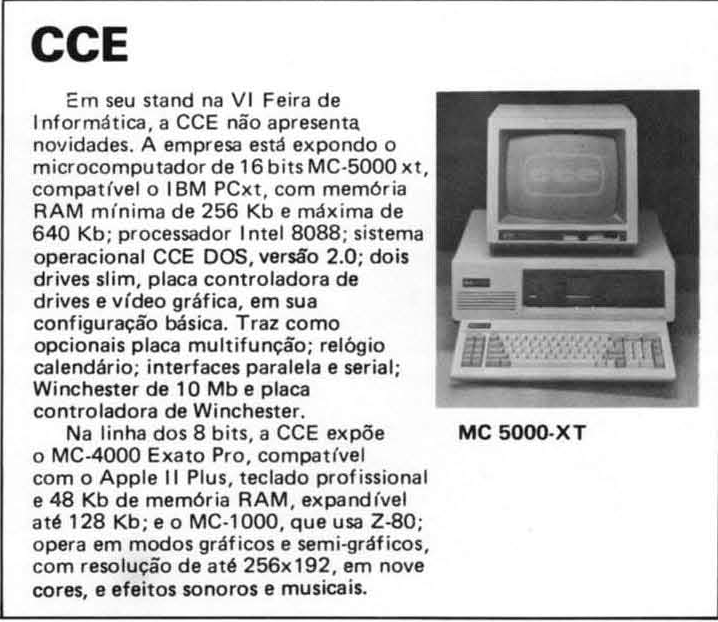

# História

## O projeto original

O MC1000 não era compatível com nenhuma das linhas de microcomputadores conhecidas no Brasil. Por muito tempo pareceu que era um projeto original da CCE, até que, graças à Internet, surgiram evidências de outros microcomputadores de origem asiática com gabinete e especificações semelhantes.

A **Vidéo Direct International (VDI)**, de Bruxelas, Bélgica, comercializava cartuchos compatíveis com Atari VCS e consoles com a marca “[home vision](https://en.wikipedia.org/wiki/Home_Vision)”, produzidos em Taiwan pela **GEM International Corporation**. A VDI também tinha um escritório e show-room em Paris, França. Em um anúncio publicado numa revista Vidéo7 em agosto de 1983 ([reproduzido no sítio Silicium.org](http://silicium.org/oldskool/wanted.htm)), a VDI anunciava um microcomputador chamado **Charlemagne** (“Carlos Magno” em francês), embora no gabinete se veja apenas a identificação **GEM 1000**:

  
Fonte: <http://silicium.org/oldskool/wanted.htm>.

Tradução do anúncio:

>   **CHARLEMAGNE**  
>   [FOTO do micro, etiquetado apenas como "GEM 1000".]  
>   **O 1º microcomputador para crianças**  
>   (dimensões 270 × 175 × 72 / peso 600g)
>
>   concebido especialmente para ser manipulado pelas crianças a partir de 5 anos.  
>   O «Charlemagne» não é um brinquedo, mas um verdadeiro computador para toda a família. Malgrado sua miniaturização, suas capacidades são fabulosas e extensíveis:
>
>   *   rom de 8K
>   *   ram de 16K extensível a 64K
>   *   cores e som
>   *   definição gráfica de 256 × 192
>   *   basic
>   *   língua francesa
>   *   joysticks para vídeo-jogos
>   *   conexões = impressora
>   *   disquetes possíveis

Examinem as fotos do GEM 1000 disponíveis em <http://www.old-computers.com/museum/photos.asp?t=1&c=420&st=1>.

A primeira foto é a mesma do cartaz acima:

  
Fonte: <http://www.old-computers.com/museum/photos/gem_1000.jpg>.

O teclado é idêntico ao do MC1000, embora o gabinete seja um pouco diferente. Há um led para indicar quando o computador está ligado. Terá sido uma versão inicial do micro?

  
Fonte: <http://www.old-computers.com/museum/photos/gem_junior_computer.gif>.

Na segunda foto, o computador vem rotulado com *três* nomes diferentes — “GEM 1000”, “JUNIOR Computer” e “Charlemagne 999” — e agora o gabinete é *totalmente* idêntico ao do MC1000. (Note os conectores EAR, MIC e JOYSTICK do flanco esquerdo, as grelhas de ventilação no topo...)

Segundo <http://www.old-computers.com/museum/computer.asp?c=420&st=1>, o GEM 1000 começou a ser produzido em 1983 e esteve à venda pelo menos até 1984.

* * *

No que parece ser uma outra encarnação da mesma especificação (embora aparentemente um pouco mais antigo), um microcomputador chamado **RX83**, da Rabbit Computer, foi [apresentado](http://www.islandnet.com/%7Ekpolsson/comphist/comp1983apr.htm) em junho de 1983 na CES ([Consumer Electronics Show](http://pt.wikipedia.org/wiki/Consumer_Electronics_Show)) de verão em Chicago, Illinois, EUA. Em um recorte do que parece ter sido uma revista de microinformática da época relatando as novidades da feira, se lê:

    
Fonte: <http://www.ballyalley.com/non-bally/rabbit_RX83.jpg>.

Tradução:

>   **Rabbit Computer**, um pequeno fabricante de Hong Kong, estava mostrando o Rabbit RX83 pela primeira vez. Esta é uma máquina de baixo custo da classe do V-Tech e do Mattel Aquarius. Ele usa um Z80A, tem 2K de RAM embutida (expansível até 64K), 50 teclas emborrachadas (sem barra de espaço), apenas maiúsculas, e comandos Basic  
>   [FOTO do RX83 em exposição]  
>   [COMENTÁRIO: O Rabbit é um novo e capaz computador de baixo custo de Hong Kong, mas, que pena, sem barra de espaço.]  
>   com um toque de tecla. Ele tem boas capacidades de gráficos com quatro modos gráficos, oito cores, caracteres gráficos definíveis pelo usuário, e resolução de 256 × 192 pixels. A velocidade de cassete são respeitáveis 1200 bauds.
>
>   Um adorável componente de software era um programa Compositor de Músicas que mostra quatro pautas padrão de música com notas durante a execução. A máquina produz som em três canais. Muito poder por 99 dólares.

O recorte traz uma foto do RX83, e seu aspecto externo é totalmente semelhante ao GEM 1000 com led. Apenas causa estranheza, na descrição, a menção a “quatro modos gráficos, oito cores, caracteres gráficos definíveis pelo usuário”. Será que a máquina tinha um interpretador BASIC diferente, com comandos para aproveitar mais facilmente seus recursos gráficos? O MC1000 pode acessar os outros modos gráficos além daqueles acessíveos pelos comandos `GR` e `HGR` (e, consequentemente, todas as cores do MC6847), mas só com `POKE`s ou `OUT`s. E o MC1000 não tinha caracteres gráficos...

Tirando isso e os 2KiB iniciais, *tudo é igual*, até mesmo a descrição do programa *Music Composer*, que vem na fita que acompanhava o MC1000 de fábrica.

Na foto do RX83 se pode notar a posição de conexão de certos cabos exatamente onde ficariam, no MC1000, a saída para a TV (à direita), a tomada de energia (atrás), a entrada de cassete (à esquerda). E também uma caixa presa à parte traseira exatamente onde fica a porta de expansão do MC1000. Talvez seja a expansão para 64K.

Em 7 de maio de 2013, pesquisando a origem do MC1000, Jair Diniz Miguel descobriu que, segundo <http://www.hkent.biz/0129195.html>, a Rabbit Computer (Hong Kong) Limited [白兔電腦(香港)有限公司] operou de 1983 a 1996.

Em 13 de janeiro de 2018, Claudio Henrique Picolo encontrou um panfleto sobre RX83 disponibilizado no sítio Archive.org em 23 de agosto de 2017:

  
Fonte: <https://archive.org/details/RabbitComputerRX83FlyerfromSummer1983CES>.

**O panfleto confirmou o parentesco do RX83 com o MC1000.** Mostra a tela de três programas, e são os mesmos do MC1000: o *Music Composer*, o *Mars Lander* e o *Guerra dos Robôs*. A tela de texto também exibe caracteres claros sobre fundo escuro.

A mensagem de inicialização é “RABBIT STANDARD BASIC V1.0” logo seguido de “OK”, sem a contagem de bytes de memória. Isso pode indicar que o interpretador BASIC é diferente, até porque a ROM do RX83 é de apenas 8KiB. A ROM do MC1000, de 16KiB, contém a infraestrutura de jogos, o programa monitor e o interpretador BASIC de 8KiB.

O panfleto não menciona os tais “caracteres gráficos definíveis pelo usuário” do recorte. Provavelmente foi um engano.

Uma curiosidade é que as teclas \<@> e \<↑> que aparecem na foto do micro na CES 1983, iguais às do MC1000, no panfleto estão etiquetadas \<BACK SPACE> e \<NEW LINE>, respectivamente.

Tradução da informação técnica:

>   Especificações: CPU: Z80A; clock: 3.58MHZ; ROM: 8KiB; RAM: 2KiB; RAM máxima: 64KiB; linguagem embutida: Rabbit standard BASIC; tela de TV: 32 caracteres por 16 linhas; cor: 8 cores vivas; vídeo: saída modulada de RF com som em 3 canais; resolução: 256 × 192 pixels; taxa de bauds: 1200; teclado: 50 teclas incluindo teclas de função especial; modo gráfico:: 4 modos inteiramente gráficos &amp; 2 modos semigráficos.
>
>   Portas de E/S: Uma porta de cassete; uma porta de expansão com 256 endereços; duas portas de joystick; uma porta de saída modulada RF + som.
>
>   Fonte de energia: Adaptador de energia de 9 volts CC 1 Amp. ou fonte CC; temperatura de operação: 0°–35°C; dimensões: 8,34" de largura (212mm) × 1,73" de altura (44mm) × 6,89" de profundidade (175mm).
>   
>   Acessórios opcionais: RA8001 — cartucho de 16KiB de RAM; RA8002 — interface de impressora Centronics com cabo; RA8003 — controles de joystick (par); RA8004 — gravador de dados em cassete; RA8005 — fita cassete de videogames/software; RA8006 — cartucho de encaixe de jogo/software; RA8007 — manual de software; RA8008 — manual de hardware; Disponível em breve: impressora térmica de matriz de pontos, modem, expansor.

O panfleto dá um endereço da Rabbit Computers em Nova Iorque e foi impresso em Hong Kong.

* * *

Em discussão no grupo Retrocomputação no Google Groups sobre a descoberta da Portaria de autorização de produção do “PC-1000” (vide abaixo) e sobre máquinas das quais supostamente o MC1000 seria clone, Eduardo Luccas [comentou](https://groups.google.com/d/msg/retrocomputacao/0jFD5FQsI-U/Q9jcj-LDHxAJ) em 3 de junho de 2013:

>   Tem uma reportagem, inclusive, que saiu na Folha na época, na Folha Informática, comentando que o pessoal da CCE estava na Ásia e trouxe um micro de lá e que ia lançar um novo micro aqui (não lembro se era em Hong-Kong ou na Córeia, depois eu procuro a reportagem no acervo da Folha pra mostrar) e, logo depois, “apareceu” o MC-1000.

Mais tarde ele encontrou a [matéria](http://acervo.folha.com.br/fsp/1984/10/31/2//4219772), que fora publicada em 31 de outubro de 1984 no caderno de Informática da Folha de São Paulo:

  
Fonte: <http://acervo.folha.com.br/fsp/1984/10/31/2//4219772>.

>   **CCE lança mais um microcomputador doméstico**
>
>   A diversificação de atividades iniciada em fevereiro deste ano, com o lançamento do seu microcomputador Exato, não representa hoje mais que 2% do seu faturamento global. Mas a partir desse final de ano essa taxa deverá crescer significativamente, com o lançamento do MC-1000, seu novo micro de uso doméstico que será apresentado ao público esta semana, na 4ª Feira Internacional de Informática, no Rio de Janeiro, e lançado comercialmente dentro de poucas semanas em Manaus. A previsão de crescimento é feita pelo gerente de marketing da empresa, João Pedro Bittencourt, que espera colocar seis mil desses equipamentos mensalmente no mercado, além dos primeiros quinze mil já encomendados pelos revendedores antes mesmo do lançamento.
>
>   Esses números são um indicativo seguro da disposição da CCE em jogar pesado nesse mercado. No desenvolvimento do MC-1000 foi gasto Cr$ 1.500 milhões e outros Cr$ 600 milhões estão engatilhados para serem disparados numa intensa campanha publicitária, a começar na feira. De acordo com Bittencourt, o mercado de micros domésticos não apresenta sinais de exaustão e, até ao contrário, a intensa demanda demonstra que não está sendo suprido satisfatoriamente pelos fabricantes.
>
>   “Nós entramos nesse mercado com uma vantagem sobre os concorrentes”, diz ele, revelando que a empresa pretende explorar a fundo a estrutura que dispõe no comércio de equipamentos de som, com cinco mil pontos de venda distribuídos por todo o país. Com essa rede de distribuição, aliada as expectativas existentes para produtos desse tipo, a CCE armou um esquema de duas hastes que deverá sustentar a expansão do seu faturamento em informática para 25% do global, acredita Bittencourt, até o final de 1985.
>
>   A idéia de um micro doméstico surgiu numa viagem do presidente da empresa, Isaac Sverner, ao Japão, em novembro passado, quando encontrou um equipamento “pequeno e versátil, um hardware fabuloso”, como define Bittencourt. Sem maiores, trouxe-o diretamente para o CPqD (Centro de Pesquisa e Desenvolvimento) da CCE, onde foi literalmente dissecado pelos pesquisadores, como se costuma fazer com os cadáveres de indigentes nas escolas de medicina.
>
>   Aberto, examinado, mexido de todas as formas, o “pequeno e versátil” japonês ganhou feições nacionais. Dos oito Kbytes de RAM originais saltou para uma memória de dezesseis Kbytes, expansíveis até 64 kbytes através da colocação de novos chips. Além disso, dispõe hoje de seis Kbytes especiais de RAM de vídeo, permitindo usar integralmente a RAM da CPU apenas para processar informações. Essa é, aliás, uma das vantagens apontadas por Bittencourt: “O MC-1000 possui três microprocessadores independentes, um Z-80 para a CPU, um VDG (Video Display Generator) para processamento de vídeo e um PSG (Programmable Sound Generator) para sintetizar sons, de modo que essas funções podem ser desenvolvidas conjuntamente sem que uma interfira no desempenho da outra”.
>
>   Cores e sons são dois pontos fortes desse pequeno de 17,5cm de comprimento, 20,5cm de largura, 4,5cm de altura e 1,240kg de peso. Pode usar até oito cores e é dotado de um sistema de feedback que indica, com duas cores no vídeo, quando a leitura das instruções está ou não sendo bem feita. Verde e vermelho, significa sim; uma só cor, não. Além disso dá as mensagens de erro, como garantia. Um comando permite sintonizar o monitor em altas resoluções (256×192 pontos), médias (128×124 pontos) e baixas (semelhantes à do Atari). Aos adeptos da sonorização dos jogos, o MC-1000 permite três níveis diferentes de sons, simulando, ao mesmo tempo, por exemplo, um piano, um violino e um violoncelo, além de vários sons aleatórios (os chamados ruídos brancos), como roncos de carros, trovões, barulho de vento, gritos e vozes sintetizadas. E, claro, não foram esquecidas duas saídas para joy-stick, compatíveis com Atari.
>
>   Ainda no nível dos chips, possui uma memória física que permite mudar a programação, em determinados lugares, para a linguagem Assembler, mantendo o restante em Basic. “É apenas nessa partezinha que o programa passa ao Assembler e depois pode voltar ao Basic novamente”, explica Bittencourt. Tem ainda função editora para inserir ou retirar caracteres do texto e um editor de linha para mover o cursor para cima e para baixo ou direcioná-lo para os lados. Utiliza um sistema operacional próprio, mas também roda programas em CP/M.
>
>   Montado com “teclado chiclete” de silicone (dos encontrados em calculadoras), deverá custar, a partir do lançamento, Cr$ 685 mil. Segundo Bittencourt, é uma máquina indicada para quem quer se iniciar na informática, porque tem “uma série de recursos de máquinas maiores” a um preço bem menor. Inclusive, diz, são planos da empresa colocar toda essa máquina numa “caixa” de porte maior e com teclado profissional para lançá-lo, em breve, como micro pessoal.
>
>   [FOTO do MC1000, acompanhado de televisor, gravador cassete DR-1000 e de dois joysticks JS-1000.]  
>   [COMENTÁRIO: O MC-1000, da CCE, é colorido e faz algumas sonorizações de games.]

Além de revelar a origem asiática do MC1000, a matéria tem outros pontos interessantes:

*   O projeto original do MC1000 tinha 8KiB de RAM — diferentemente do que as fontes acima dizem sobre o GEM-1000, que tinha 16KiB, e do RX83, que tinha 2KiB.
*   A matéria menciona a expansão de memória até 64KB “através da colocação de novos chips”, em vez de mencionar mais especificamente o cartucho de expansão de memória. Seria uma referência à [mod de 64KiB](mods)?
*   A menção a “resoluções médias” de 128×124 está obviamente errada (os [modos gráficos](modos_de_video) do MC6847 têm resolução vertical de 64, 96 ou 192 pixels).
*   A função do editor de linha para “mover o cursor para cima e para baixo ou direcioná-lo para os lados” seria realizada com as teclas \<H>, \<J>, \<K> e \<L> combinadas com \<CTRL>, mas foi inutilizada por causa do [bug](bugs) do `CHR$(12)`.
*   O MC1000 numa “caixa de porte maior e com teclado profissional” seria o MC1500, que nunca foi lançado.

* * *

Em 20 de agosto de 2013, a origem asiática do MC1000 foi confirmada por um ex-funcionário da CCE. A matéria acima mencionando o Japão ainda não tinha sido reencontrada. De memória, ex-funcionário informou que:

*   O projeto original era chinês. Um engenheiro/representante chinês veio ao Brasil apresentar o projeto à CCE.
*   Não foi apresentado um produto já em produção, mas um protótipo.
*   O ex-funcionário não se lembrava de ter visto protótipos das interfaces de disco, do cartão de 80 colunas, etc.
*   Alguma parceria foi efetivamente firmada entre a CCE e a fábrica chinesa para a produção do MC1000. Ele não foi clonado por engenharia reversa.
*   Houve muito desenvolvimento: Adaptações de hardware (para PAL-M, por exemplo, ou para adequação de componentes), gabinete, projeto de teclado, identidade visual, embalagem, software… O pessoal da engenharia trabalhou muitos meses até finalizar o produto.
*   Da ROM a CCE recebeu pouca informação: apenas o *dump* e uma listagem em Assembly sem comentários. O **Hugo Corenzan Jr.** foi quem se debruçou sobre o material para estudar e decifrar seu funcionamento. Ele também foi o responsável pelas alterações necessárias. Ele chegou, inclusive, a implementar alguns comandos que existiam no prompt do Apple II (Exato).

* * *

## O pré-lançamento

Em 13 de junho de 2013, pesquisando a origem do MC1000, Jair Diniz Miguel encontrou publicada no [Diário Oficial da União de 9 de fevereiro de 1984](https://www.jusbrasil.com.br/diarios/3179812/pg-5-secao-1-diario-oficial-da-uniao-dou-de-09-02-1984) uma Portaria da [Secretaria Especial de Informática](http://pt.wikipedia.org/wiki/Pol%C3%ADtica_Nacional_de_Inform%C3%A1tica) de 6 de fevereiro de 1984 autorizando a CCE a produzir um microcomputador então denominado **“PC-1000”** com configuração aproximada àquela que o MC1000 viria a ter:

>   **Secretaria Especial de Informática**
>
>   PORTARIA Nº 25, DE 06 DE FEVEREIRO DE 1984
>
>   **O Secretário de Informática**, no uso de suas atribuições, tendo em vista o disposto no artigo 5º, incisos III, VIII, XXI e XXVI, do Decreto nº 84.067, de 08 de outubro de 1979, e no Ato Normativo nº 016/81, de 10 de julho de 1981,
>
>   RESOLVE:
>
>   Art. 1º — Fica aprovado, com modificações em relação ao que consta do Processo nº F - 000260, o projeto apresentado por CCE DA AMAZÔNIA S.A., inscrita no Cadastro Geral dos Contribuintes do Ministério de Fazenda sob o nº 04.169.843/0001-77, para fabricação do microcomputador de uso pessoal, modelo PC-1000, com as seguintes características básicas:
>
>   -   microprocessador Zilog Z-80;
>   -   64 KBytes/memória RAM;
>   -   8 KBytes/memória ROM;
>   -   interface para receptor cromático de televisão, sistema PAL padrão M;
>   -   teclado alfanumérico ASCII;
>   -   interface para impressora serial;
>   -   interface para unidade de discos flexíveis;
>   -   interface para comunicações, CCITT V/24 e RS-232;
>   -   linguagens BASIC e ASSEMBLER.
>
>   Art. 2º — Para fabricação do produto mencionado no artigo 1º, serão admitidas importações, diretamente de fabricantes originais, das seguintes partes e peças:
>
>   -   circuitos integrados de fabricação e uso gerais, não encapsulados no País;
>   -   componentes de valor e conteúdo tecnológico pouco significativos e não disponíveis. no Brasil.
>
>   Parágrafo Único — As importações para execução deste projeto serão realizadas pela praça de Manaus, de acordo com o programa constante do Processo nº F - 000260, e limitadas pelas quotas atribuídas pela Superintendência da Zona Franca de Manaus — SUFRAMA.
>
>   Art. 3º — A industrialização destes produtos será realizada sem dependência de qualquer natureza a fontes externas de tecnologia.
>
>   Art. 4º — Os equipamentos destinados a operar em redes públicas de telecomunicações, deverão possuir características compatíveis com as Recomendações das Séries V e X do CCITT, nas versões padronizadas no Brasil pelo Ministério das Comunicações.
>
>   Art. 5º — Esta Portaria entrará em vigor na data de sua publicação.
>
>   JOUBERT DE OLIVEIRA BRÍZIDA

(A produção do MC4000 Exato tinha sido aprovada meses antes, pela [Portaria SEI nº 194, de 30 de novembro de 1983](http://www.jusbrasil.com.br/diarios/3520507/dou-secao-1-02-12-1983-pg-9), publicada no DOU de 2 de dezembro de 1983.)

No [DOU de 23 de maio de 1984](http://www.jusbrasil.com.br/diarios/3399055/dou-secao-1-23-05-1984-pg-38), o Conselho de Administração da [SUFRAMA](http://www.suframa.gov.br/) publicou que tinha baixado em 27 de abril de 1984, entre outras, a

>   Portaria Nº 148/84 — CCE DA AMAZÔNIA S/A: objetivando a produção de um novo modelo de microcomputador;

Em 22 de agosto de 2013, um ex-funcionário da CCE confirmou que PC-1000 era o nome original do MC1000. O novo nome foi dado segundo o padrão do MC4000, que inicialmente era um código interno do Exato, mas que “vazou” e “pegou”, e então os outros produtos da empresa passaram a ser nomeados acima ou abaixo de 4000 conforme seu poder computacional: MC1000, MC1500 e MC2000 (MSX) abaixo; e o MC5000 (PC/XT) acima.

* * *

Em 21 de novembro de 1984, a coluna Circuito do caderno de Informática da Folha de São Paulo registrou:

  
Fonte: <http://acervo.folha.com.br/fsp/1984/11/21/75//5404346>.

>   **CCE investindo**
>
>   Cerca de Cr$ 10 bilhões. É esse o montante que promete investir no próximo ano a CCE no setor de microcomputadores, com o lançamento de três novas máquinas. A informação é do diretor-superintendente comercial da empresa, Luís Muro. Ele também informa que a fábrica injetou Cr$ 4,5 bilhões em 84 na industrialização dos micros MC-4000 e MC-1000. Segundo planos da CCE, em 1985 os microcomputadores significarão de 2 a 3% do faturamento total.

Em 28 de novembro, o caderno de Informática da Folha de S. Paulo já mencionava o MC1000 como uma das opções de presentes tecnológicos para o Natal. Sendo-lhe atribuído o preço de Cr$ 700 mil, era comparado com outras opções de microcomputadores: os monocromáticos TK85 (Cr$ 500 mil) e CP300 (Cr$ 950 mil) e os coloridos CP400 (Cr$ 1 milhão) e TKS-800 (da Microdigital, Cr$ 1,1 milhão).

* * *

## Lançamento, marketing e comercialização

O MC1000 foi lançado no Brasil pela CCE em fevereiro de 1985.

Em 6 de março de 1985, a coluna Circuito do caderno de Informática da Folha de São Paulo registrou:

  
Fonte: <http://acervo.folha.com.br/fsp/1985/03/06/2//4107283>.

>   **Micro CCE nas lojas**
>
>   A partir deste mês, a CCE coloca nas lojas seu micro MC 1000, anunciado no final do ano passado. Com ele também chegam ao mercado o gravador cassete DR 1000, o joystick JS 1000 e um monitor de vídeo monocromático, o MV 12. […] Os preços sugeridos para revenda são: MC 1000, Cr$ 1,1 milhão, monitor, Cr$ 1 milhão; gravador, Cr$ 230 mil e joystick, Cr$ 36 mil.

Os planos da CCE na área de informática à época estão resumidos nesta matéria (Revista [Micro Sistemas](http://pt.wikipedia.org/wiki/Revista_Micro_Sistemas), março de 1985, p. 25):

  
Fonte: <http://cobit.mma.com.br/manchetes/cce.htm>.

>   **CCE a Todo Vapor**
>
>   A CCE entrou o ano de 85 a caminho da concretização daquilo que a empresa havia adiantado no final do ano passado: o lançamento de três novos micros. Em fevereiro, a CCE colocou no mercado o primeiro irmão do Exato, o MC 1000, que veio para concorrer diretamente com os micros pessoais de baixo preço disponíveis no mercado. O novo equipamento foi lançado com suporte de 50 jogos e já estão sendo colocados no mercado mais 100 programas aplicativos desenvolvidos por software houses credenciadas pela CCE. Também já estão disponíveis a expansão de memória de 64 Kbytes, a placa para o MC 1000 rodar programas em CP/M e a interface para utilização de disquetes de 5 1/4″, com 170 Kb cada um, face simples e dupla densidade. Para o Exato a CCE colocou no mercado, nos primeiros meses do ano, um monitor de vídeo de 12″, fósforo verde ou âmbar (opcional), e as placas CP/M e 80 colunas.
>
>   Mas as grandes novidades anunciadas pela empresa ainda estão por vir. Para o segundo semestre está previsto o lançamento do terceiro membro da família de micros CCE, o MC-1500, uma versão ampliada do MC 1000 com gabinete maior e teclado profissional. As interfaces lançadas para o MC 1000 deverão já vir embutidas nesse novo equipamento. Para a Feira de Informática desse ano a CCE promete o lançamento de um micro de 16 bits compatível com o modelo XT da IBM. E na linha de 8 bits a CCE deverá apresentar também um novo equipamento baseado no microprocessador Z-80 e na tecnologia MSX, desenvolvida por um pool de grandes empresas japonesas. O MC 2000 terá memória ROM de 32 Kbytes com uma série de rotinas que facilitarão o trabalho do usuário.

* * *

Em julho de 1985 a CCE realizou uma ação de marketing no shopping Mappin Itaim, oferecendo um curso grátis de informática/BASIC MC1000 com duração de 3~4 horas. Por telefone se obtinham informações e se faziam reservas. O MC1000 era então vendido a Cr$ 800,00. (Fonte: <http://acervo.folha.com.br/fsp/1985/07/17/75//4146050>.)

* * *

## Descontinuação

O MC1000 continuava sendo comercializado em agosto de 1986, como se vê nesta matéria (Revista Micro Sistemas, agosto de 1986, p. 33):

>   **CCE**
>
>   Em seu stand na VI Feira de Informática, a CCE não apresenta novidades. A empresa está expondo o microcomputador de 16 bits MC-5000 xt, compatível com o IBM PCxt, com memória RAM mínima de 256 Kb e máxima de 640 Kb; processador Intel 8088; sistema operacional CCE DOS, versão 2.0; dois drives slim, placa controladora de drives e vídeo gráfica, em sua configuração básica. Traz como opcionais placa multifunção; relógio calendário; interfaces paralela e serial; Winchester de 10 Mb e placa controladora de Winchester.
>
>   Na linha dos 8 bits, a CCE expõe o MC-4000 Exato Pro, compatível com Apple II Plus, teclado profissional e 48 Kb de memória RAM, expandível até 128 Kb; e o MC-1000, que usa Z-80; opera em modos gráficos e semi-gráficos, com resolução de 256×192, em nove cores, e efeitos sonoros e musicais.

Mas será que ainda era produzido, ou era apenas ponta de estoque? Poucos meses antes, na Micro Sistemas nº 54 de março de 1986, seção Bits, p. 14, se lia:

>   **MC 5000 XT, da CCE**
>
>   A CCE está comercializando o seu novo equipamento MC 5000XT desde fevereiro. (...)
>
>   Segundo João Bittencourt, Gerente de Marketing da Divisão de Informática, a CCE deve colocar novos equipamentos no mercado a partir de maio, todos na área de micros mais potentes para atividades profissionais.

Isto parece indicar que nesse ponto a CCE já tinha desistido do MC1000. Ele não resistiu à chegada de máquinas melhor concebidas e cheias de software, como o TK-90X (lançado em junho de 1985) e os MSX (novembro e dezembro de 1985), e à ascensão das máquinas de 16 bits. A CCE passou a focar no Exato Pró e no MC5000 XT.

* * *

## Um depoimento

Eis aqui um interessante depoimento sobre o MC1000 por [Divino Carlos Rodrigues Leitão](http://divinoleitao.blog.br/), que na época trabalhava no CPD da revista Micro Sistemas:

>   Minha aproximação com o MC-1000 foi completamente diversa da de todos os outros micros, eu estava no [Rock In Rio](http://pt.wikipedia.org/wiki/Rock_in_Rio) e dispensei ver o show da [Nina Hagen](http://pt.wikipedia.org/wiki/Nina_Hagen) [domingo, 20 de janeiro de 1985], estava olhando o stand da CCE e vi o micrinho com a tela colorida e fiquei surpreso.
>
>   Como estava aberto ao público fiquei brincando com o BASIC dele e fiz um programinha que plotava o logo do Rock In Rio na tela, aquela guitarra com o mapa do Brasil.
>
>   Fui fazendo e testando, quando percebi tinha um monte de gente atrás de mim olhando e entre eles uma belíssima loira que era a gerente de produto do bichinho e mais uns sujeitos de terno, que soube depois serem diretores da CCE.
>
>   A loira me deu um cartão e marquei uma entrevista em Copacabana, levei os programas que tinha feito para o ZX 81 e mais uns projetos, os caras queriam que eu fizesse para o MC-1000 e falei que seria moleza.
>
>   Ela mesmo foi entregar os equipamentos no meu apê, lembro que minha mulher ficou meio furiosa porque não acreditava que aquilo acontecia, que uma empresa estaria me “dando” aquilo tudo, ali tinha caso com a loira... Hua! hua! hua! Quem dera...
>
>   Antes de começar a desenvolver os jogos eles queriam que eu fizesse um programinha para calcular o IR da época, achei que ia ser moleza fazer no BASIC mesmo mas não consegui, simplesmente [para exibir valores com mais de seis casas, o BASIC do micro arredondava a parte decimal (32768,05 → `32768.1`) ou] entrava em notação científica [(1.000.000 → `1E+06`)]... Hua, adivinhem só quanto dava qualquer cálculo na moeda da época.
>
>   Parti pra desenvolver rotinas em Z80 para fazer os cálculos e imprimir na tela, mas não conhecia [as rotinas de ROM] do bichinho e passou do prazo... então parti para fazer os jogos.
Ih... Nada, comecei pelo [Valkirie](http://zx81.eu5.org/ciberne.htm) [adaptação anterior do Divino para ZX 81 do jogo [Voyage of the Valkyrie](https://www.google.com.br/search?q=%22voyage+of+the+valkyrie%22+%22trs-80%22+OR+%22apple%22), originalmente lançado para TRS-80 e Apple II], até ficaram legais as telas, mas em BASIC ficava muito lerdo e a [ROM] do bichinho continuava um mistério pra mim, os manuais que me entregaram não eram corretos e a turma do “desenvolvimento” do micro não conseguiu me ajudar, fui lá em Sampa pra aprender com eles e acabei ensinando uns truques para os caras, mas a verdade é que não conseguia fazer um programa decente no micro.
>
>   De repente ele saiu do mercado... Simplesmente me ligaram e disseram que o projeto estava cancelado e que não precisava nem devolver o material...

(Uma outra versão deste depoimento se encontra em <http://web.archive.org/web/20080208115846/http://www.tilt.net/wiki/index.php/A_CCE_entra_no_mercado_de_micros>).

Comentário adicional do Divino:

>   Interessante ler estes depoimentos, foi uma época cheia de surpresas e o MC 1000 foi uma surpresa que infelizmente não teve final feliz. Era um belo e promissor micrinho mas apesar de toda a boa intenção da CCE foi (junto com quem o comprou) mais uma vítima das patuscadas que militares + governo faziam com a gente, com a desculpa que estavam cuidando do futuro do nosso pais.
