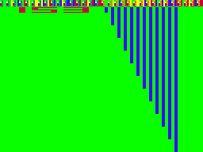

# Modos de vídeo

O chip responsável por converter o conteúdo da RAM em imagens é o *Video Display Generator*  [Motorola MC6847](http://pt.wikipedia.org/wiki/Motorola_MC6847), usado também no [TRS-80 Color Computer](http://pt.wikipedia.org/wiki/TRS-80_Color_Computer) / [Prológica CP400](http://pt.wikipedia.org/wiki/CP400) e em outros microcomputadores da época.

O  [BASIC](https://sites.google.com/site/ccemc1000/basic)  do MC1000, por ser baseado no BASIC do Apple II, só oferece três opções de modos de vídeo, acessados pelos comandos  `TEXT`,  `GR`  e  `HGR`.

Porém, o chip MC6847 oferece outros modos de vídeo, que podem ser acessados por meio da  [porta de saída](portas)  COL32 ($80 / 128). Essa porta acessa um  *latch*  de 8 bits, um componente eletrônico que retém um valor e cujos bits (exceto o bit 0) alimentam os pinos do MC6847 que definem o modo de vídeo:

| Bit de COL32 | Pino do MC6847 | Função |
| :-: | :-: | :-- |
| 7 | ¬A/G | 0 = modo não gráfico; 1 = modo gráfico. |
| 6 | ¬A/S | Se modo não gráfico: 0 = modo alfanumérico; 1 = modo semigráfico. |
| 5 | ¬INT/EXT | Se modo alfanumérico: 0 =  [conjunto interno de caracteres](conjunto_de_caracteres); 1 = caracteres obtidos de ROM externa. <br> Se modo semigráfico: 0 = modo semigráfico 4; 1 = modo semigráfico 6. |
| 4, 3, 2 | GM2, GM1, GM0 | Se modo gráfico: Seleciona qual modo gráfico. |
| 1 | CSS| Seleciona paleta de  [cores](cores). |
| 0 | — | Comutação de bancos (*bank switching*): 0 = Z80 acessa VRAM; 1 = Z80 acessa RAM. |

O que nos dá os seguintes modos de vídeo (assumindo bit 0 = 1):

| Amostra ([vide programa](https://github.com/ensjo/mc1000-software/tree/master/emerson/Modos%20de%20v%C3%ADdeo)) | Valor de COL32 | Modo | Dimensões | Descrição |
| :-: | :-: | :-: | :-- | :-- |
|  | $01 / 1 (`TEXT`) | *Alphanumeric Internal*  (CSS=0) | 32×16 caracteres. <br> 32 bytes por linha × 16 linhas = 512 bytes ($8000–$81FF). | Caracteres verdes-escuros. Fundo verde. Borda preta. (*) |
|  | $03 / 3 | *Alphanumeric Internal*  (CSS=1) | 32×16 caracteres. <br> 32 bytes por linha × 16 linhas = 512 bytes ($8000–$81FF). | Caracteres vermelhos-escuros. Fundo laranja. Borda preta. (*) |
|  | $41 / 65 | *Semigraphics 4* | 32×16 caracteres. <br> 64×32 "pixels". <br> 32 bytes por linha × 16 linhas = 512 bytes ($8000–$81FF). | O espaço de cada caracter é dividido em quatro partes (2×2). Os bits 0–3 indicam quais partes ficam acesas. Os bits 4–6 indicam a cor das partes acesas (verde, amarelo, azul, vermelho, branco, ciano, magenta, laranja). O bit 7 é ignorado. Fundo preto. Borda preta. |
|  | $61 / 97 | *Semigraphics 6*  (CSS=0) | 32×16 caracteres. <br> 64×48 "pixels". <br> 32 bytes por linha × 16 linhas = 512 bytes ($8000–$81FF). | O espaço de cada caracter é dividido em seis partes (2×3). Os bits 0–5 indicam quais partes ficam acesas. Os bits 6–7 indicam a cor das partes acesas (verde, amarelo, azul, vermelho). Fundo preto. Borda preta. |
|  | $63 / 99 | *Semigraphics 6*  (CSS=1) | 32×16 caracteres. <br> 64×48 "pixels". <br> 32 bytes por linha × 16 linhas = 512 bytes ($8000–$81FF). | O espaço de cada caracter é dividido em seis partes (2×3). Os bits 0–5 indicam quais partes ficam acesas. Os bits 6–7 indicam a cor das partes acesas (branco, ciano, magenta, laranja). Fundo preto. Borda preta. |
|  | $81 / 129 | *Color Graphics 1*  (CSS=0) | 64×64 pixels. <br> 16 bytes por linha × 64 linhas = 1024 bytes ($8000–$83FF). | Verde, amarelo, azul, vermelho. Fundo verde. Borda verde. |
|  | $83 / 131 | *Color Graphics 1*  (CSS=1) | 64×64 pixels. <br> 16 bytes por linha × 64 linhas = 1024 bytes ($8000–$83FF). | Branco, ciano, magenta, laranja. Fundo branco. Borda branca. |
|  | $85 / 133 | *Resolution Graphics 1*  (CSS=0) | 128×64 pixels. <br> 16 bytes por linha × 64 linhas = 1024 bytes ($8000–$83FF). | Verde-escuro, verde. Fundo verde-escuro. Borda verde. |
|  | $87 / 135 | *Resolution Graphics 1*  (CSS=1) | 128×64 pixels. <br> 16 bytes por linha × 64 linhas = 1024 bytes ($8000–$83FF). | Preto, branco. Fundo preto. Borda branca. |
|  | $89 / 137 (`GR`) <br> (No TRS-80 Color Computer:  `PMODE3: SCREEN0`) | *Color Graphics 2*  (CSS=0) | 128×64 pixels. <br> 32 bytes por linha × 64 linhas = 2048 bytes ($8000–$87FF). | Verde, amarelo, azul, vermelho. Fundo verde. Borda verde. |
|  | $8B / 139 <br> (No TRS-80 Color Computer:  `PMODE3: SCREEN1`) | *Color Graphics 2*  (CSS=1) | 128×64 pixels. <br> 32 bytes por linha × 64 linhas = 2048 bytes ($8000–$87FF). | Branco, ciano, magenta, laranja. Fundo branco. Borda branca. |
|  | $8D / 141 | *Resolution Graphics 2*  (CSS=0) | 128×96 pixels. <br> 16 bytes por linha × 96 linhas = 1536 bytes ($8000–$85FF). | Verde-escuro, verde. Fundo verde-escuro. Borda verde. |
|  | $8F / 143 | *Resolution Graphics 2*  (CSS=1) | 128×96 pixels. <br> 16 bytes por linha × 96 linhas = 1536 bytes ($8000–$85FF). | Preto, branco. Fundo preto. Borda branca. |
|  | $91 / 145 | *Color Graphics 3*  (CSS=0) | 128×96 pixels. <br> 32 bytes por linha × 96 linhas = 3072 bytes ($8000–$8BFF). | Verde, amarelo, azul, vermelho. Fundo verde. Borda verde. |
|  | $93 / 147 | *Color Graphics 3*  (CSS=1) | 128×96 pixels. <br> 32 bytes por linha × 96 linhas = 3072 bytes ($8000–$8BFF). | Branco, ciano, magenta, laranja. Fundo branco. Borda branca. |
|  | $95 / 149 | *Resolution Graphics 3*  (CSS=0) | 128×192 pixels. <br> 16 bytes por linha × 192 linhas = 3072 bytes ($8000–$8BFF). | Verde-escuro, verde. Fundo verde-escuro. Borda verde. |
|  | $97 / 151 | *Resolution Graphics 3*  (CSS=1) | 128×192 pixels. <br> 16 bytes por linha × 192 linhas = 3072 bytes ($8000–$8BFF). | Preto, branco. Fundo preto. Borda branca. |
|  | $99 / 153 | *Color Graphics 6*   CSS=0) | 128×192 pixels. <br> 32 bytes por linha × 192 linhas = 6144 bytes ($8000–$97FF). | Verde, amarelo, azul, vermelho. Fundo verde. Borda verde. |
|  | $9B / 155 | *Color Graphics 6*  (CSS=1) | 128×192 pixels. <br> 32 bytes por linha × 192 linhas = 6144 bytes ($8000–$97FF). | Branco, ciano, magenta, laranja. Fundo branco. Borda branca. |
|  | $9D / 157 <br> (No TRS-80 Color Computer:  `PMODE4: SCREEN0`) | *Resolution Graphics 6*  (CSS=0) | 256×192 pixels. <br> 32 bytes por linha × 192 linhas = 6144 bytes ($8000–$97FF). | Verde-escuro, verde. Fundo verde-escuro. Borda verde. |
|  | $9F / 159 (`HGR`) <br> (No TRS-80 Color Computer:  `PMODE4: SCREEN1`) | *Resolution Graphics 6*  (CSS=1) | 256×192 pixels. <br> 32 bytes por linha × 192 linhas = 6144 bytes ($8000–$97FF). | Preto, branco. Fundo preto. Borda branca. |

(*) O circuito do MC1000 liga o bit 7 do byte lido da VRAM ao pino INV do MC6847. Por isso, nos modos alfanuméricos, os caracteres de código ASCII de 0 a 127 aparecem claros sobre fundo escuro, e os de 128 a 255 aparecem escuros sobre fundo claro.

No BASIC, definimos o valor de COL32 por meio da instrução  `OUT 128,`_x_. E se você subtrair 1 dos valores da tabela acima, poderá ler e escrever na VRAM a partir do endereço de memória 32768 ($8000).

```
10  GR
20  OUT 128,130
30  FOR A = 0 TO 255
40  POKE 32768 + A,A
50  NEXT
```

No entanto, alguns eventos do MC1000 (intermitência do cursor, escrita de texto na tela, etc.) leem o valor da variável do sistema MODBUF ($00F5 / 245) e redefinem COL32 com esse valor, e assim podem anular algum comando OUT que você tiver emitido. É o que acontece no programa acima: ao imprimir "OK" quando o programa acaba, o MC1000 joga para a porta COL32 o conteúdo do endereço MODBUF (que é 137, que foi colocado pelo comando  `GR`  na linha 10), e a tela volta a ter a cara do modo  `GR`.

Em tais situações, em vez de (ou além de) emitir o comando  `OUT 128,`_x_, pode ser útil emitir o comando  `POKE 245,`_x_.

```
10  TEXT : HOME
20  PRINT "VISUALIZANDO TELA DE FUNDO VERDE"
30  INPUT "PRESSIONE ENTER";X$
40  POKE 245,3
50  PRINT "VISUALIZANDO TELA DE FUNDO VERMELHO"
```

Aqui nem foi preciso emitir o comando  `OUT`, porque o  `PRINT`  da linha 50 se encarrega de fazê-lo.

Um exemplo prático útil: Quando um erro ocorre em modo gráfico você não consegue ler a mensagem de erro correspondente (porque o MC1000 continua em modo gráfico e os caracteres aparecem como pontos na tela; e se você emitir um comando  `TEXT`  ou  `HOME`  para voltar ao modo texto a tela é apagada). Nesse caso, digite  `POKE 245,1`  para passar ao modo texto sem limpar a tela e poder ler a mensagem de erro.

```
10  GR
20  GOTO : REM PRODUZ "LI ERRO EM 20"
RUN
POKE 245,1
```

Outra forma de fazer o MC1000 a passar para o modo texto sem apagar a tela é dar o comando  `DEBUG`. (Dica de Kleber Desan na revista Micro Sistemas nº 55, de abril de 1986.)