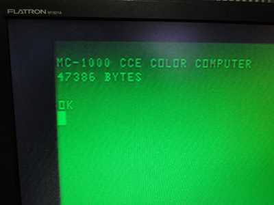
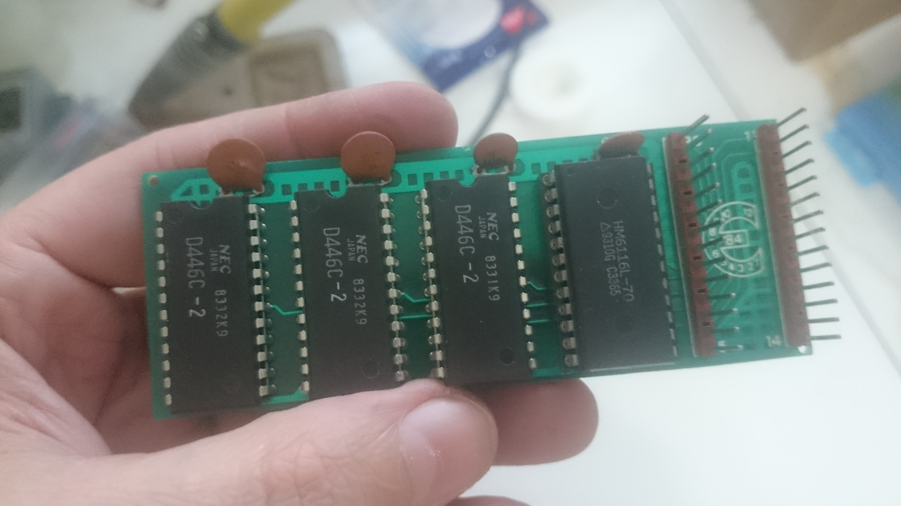
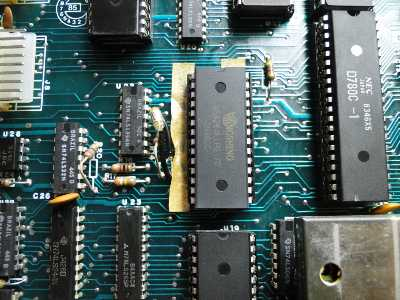
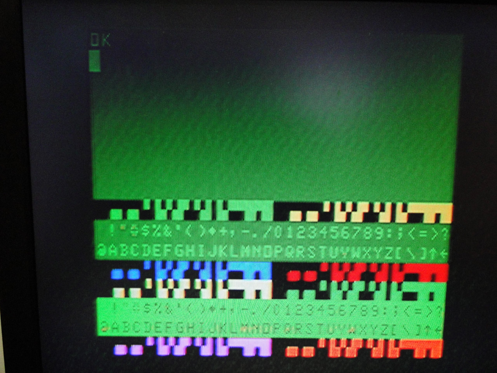

# Mods

Estas são algumas modificações ("*mods*") para ampliar as capacidades originais do MC1000.

## 64KiB de RAM interna (FACÍLIMO!)

O MC1000 tem só 16KiB de memória RAM interna, e a [expansão de memória de 64KiB](perifericos) (EM1000) para encaixar na [porta de expansão](porta-de-expansao) é um item que poucos devem ter conseguido adquirir. Mas uma análise da [placa-mãe](hardware) do MC1000 revelou que a placa-mãe vinha preparada de fábrica para uma eventual troca dos 8 chips de 16Kibits por 8 chips de 64Kibits, bastando apenas cortar o circuito em alguns pontos e soldar outros, já devidamente marcados para isso. Como a ROM se sobrepõe à RAM, apenas 48KiB estarão disponíveis a princípio. Alguns periféricos (placa CP/M) ativariam um sinal na porta de expansão para desativar a ROM, e assim ganhar acesso total aos 64KiB.

* Descoberta no blog do Ensjo (Emerson Costa): <http://ensjo.blogspot.com/2012/06/mc-1000-preparado-de-fabrica-para-64kb.html>.
* Passo-a-passo no sítio do Victor Trucco: <http://www.victortrucco.com/Diversos/MC1000/MC1000.asp>.

## 8KiB de VRAM (FACÍLIMO!)

A RAM de vídeo original do MC1000 é de 6KiB, o suficiente para todos os [modos de vídeo](modos_de_video) oferecidos pelo co-processador MC6847. Trata-se de uma plaquinha suspensa com três chips de 2KiB, espetada no meio da placa-mãe como se fosse um trampolim.

Quando a VRAM é habilitada (um número par é enviado à [porta](portas) COL32), os endereços de $8000 a $9FFF passam a acessar a VRAM em vez da RAM. A RAM original com 6KiB só permite endereços de $8000 a $97FF. Com a modificação, temos mais 2KiB à disposição na VRAM, de $97FF a $9FFF, que nunca são acessados pelo co-processador de vídeo (pois ele precisa no máximo de 6KiB). Ficam disponíveis para o programador fazer o que quiser com eles!

### Opção 1: Aumentando a capacidade da placa de VRAM com um chip de 2KiB

A placa de VRAM tem espaço e trilhas para um chip adicional de SRAM de 2KiB (D446C-2 ou [6116-7](http://www.alldatasheet.com/datasheet-pdf/pdf/77359/HITACHI/HM6116.html)).

* Fotos da operação num álbum de Lisias Toledo no Google: <https://goo.gl/photos/f4PNR5q7WcNbsk2H7>.
* Programas de teste das memórias: <https://bitbucket.org/lst_retro/mc-1000-system-software>.

Curiosamente, o esquemático não traz nenhuma indicação sobre a existência do espaço e trilhas para o quarto chip. Mas eles estão lá, no layout e na placa física, e isso torna a mod possível.

### Opção 2: Substituindo a placa de VRAM por um chip único de 8KiB

Assim como no caso da RAM, a placa-mãe vinha preparada para a substituição da plaquinha de VRAM por um chip único de 8KiB.

* Descoberta no blog do Ensjo: <http://ensjo.blogspot.com/2012/06/mc-1000-preparado-de-fabrica-para-64kb.html>.
* Passo-a-passo no sítio do Victor Trucco: <http://www.victortrucco.com/Diversos/MC1000/MC1000.asp>.

## 16KiB de ROM em chip único (FACÍLIMO!)

Essa é uma modificação que interessaria mais à própria CCE, por baratear os custos de produção, pois não oferece nenhuma vantagem para o usuário final.
A ROM do MC1000 é na verdade dois chips de EPROM de 8KiB cada. A placa-mãe também vinha preparada para a substituição dos dois chips 2764 de 8KiB por um único chip 27128 de 16KiB.

Antes de mais nada, é preciso, claro, comprar a EPROM de 16KiB e gravar nela o conteúdo desejado.

Há um ponto de corte e um ponto de solda, bem próximos e conectados, na parte de baixo da placa, sob o slot "U12" (o slot de EPROM que fica mais perto da traseira do micro). O novo chip de 16KiB fica nesse slot "U12", e o slot "U17" deve ficar vazio.

## Blocos coloridos no modo texto

Outros micros da época do MC1000 que usavam o mesmo co-processador de vídeo MC6847 implementavam circuitos ao seu redor que permitiam a alternância entre os [modos de vídeo](modos_de_video) alfanumérico e semigráficos durante o desenho da tela, permitindo que blocos de texto coloridos aparecessem junto com os caracteres de texto. Esta é uma implementação dessa ideia no MC1000.

* Proposta no blog do Ensjo: <http://ensjo.blogspot.com.br/2012/08/ideia-de-mod-para-mc-1000-blocos.html>.
* Esquema do circuito no sitio do Victor Trucco: <http://www.victortrucco.com/Diversos/MC1000/MC1000.asp>.

## Substituição da saída RF para saída A/V

Com esta modificação o conector "TV" passa a fornecer sinal de TV em [vídeo-composto](http://pt.wikipedia.org/wiki/V%C3%ADdeo_composto) (em vez de RF), e a saída "MONITOR" é usada para fornecer o áudio.

* Esquema do circuito no sítio do Victor Trucco: <http://www.victortrucco.com/Diversos/MC1000/MC1000.asp>.

## Conectores no lugar dos pontos de solda da placa do teclado

Modificação concebida e executada por Claudio H. Picolo. Ver a descrição do processo com fotos no [arquivo PDF anexo](doc/Workshop-cabos-de-teclado.pdf).
