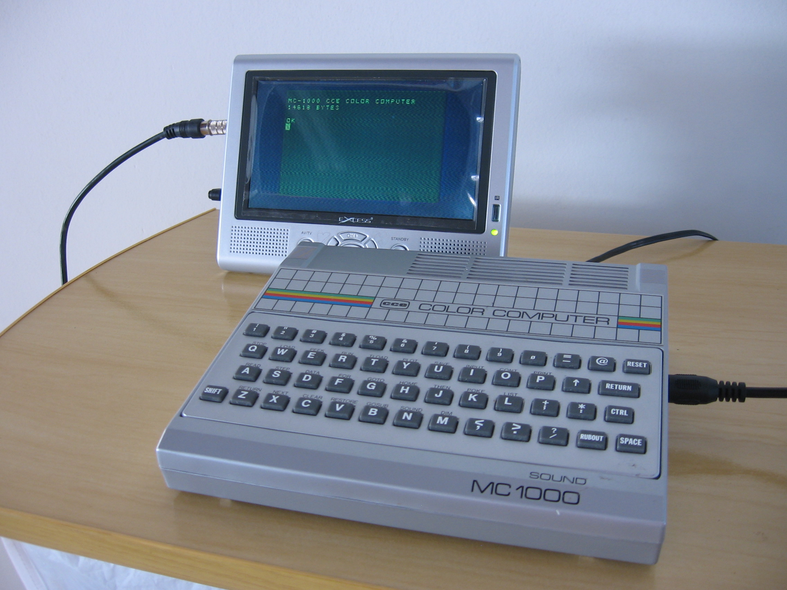
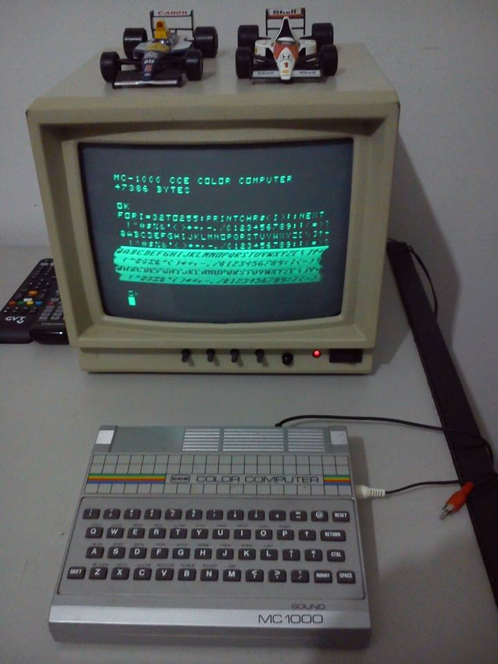
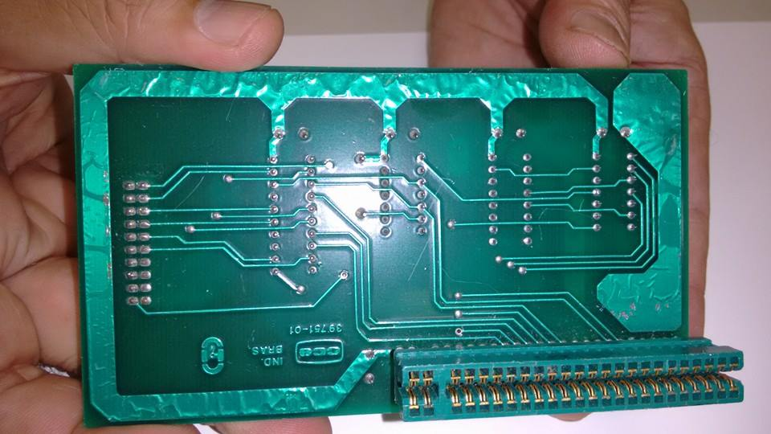

# Periféricos

Eis os conectores do MC1000:

## Power Supply PS1000

A fonte de força externa que converte a corrente alternada da rede elétrica (há um seletor de voltagem) em corrente contínua de 9V.

É uma fonte simples que usava retificação de meia-onda, com dois diodos. Diretamente da caixinha sai um [plugue padrão americano (NEMA)](http://pt.wikipedia.org/wiki/Conector_NEMA), sem terra. Da caixa sai também um cabo com um [plugue P2](http://pt.wikipedia.org/wiki/Conector_TRS) na ponta, que se conecta a um jaque na traseira do MC1000.

## Televisor colorido

Qualquer [televisor](http://pt.wikipedia.org/wiki/Televisor) podia ser usado como monitor, seja ele colorido ([PAL-M](http://pt.wikipedia.org/wiki/PAL-M)) ou preto e branco.

O cabo original de [RF](http://pt.wikipedia.org/wiki/Radiofrequ%C3%AAncia) que vinha com o MC1000 conectava sua saída [RCA](http://pt.wikipedia.org/wiki/Conector_RCA) a um *baloon* que casava a impedância do sinal de RF de 75Ω para 300Ω para ser compatível com os antigos conectores parafusados de antena da maioria dos televisores dos anos 80. Atualmente, pode-se fazer um cabo RF de 75Ω com um conector RCA numa ponta e um moderno conector de RF na outra para usá-lo em televisores modernos sem a necessidade de *baloon* ou casador de impedância.

## Monitor monocromático

Na lateral direita do MC1000 há uma saída de imagem em [vídeo composto](http://pt.wikipedia.org/wiki/V%C3%ADdeo_composto) preto-e-branco rotulada "MONITOR". Em tese, qualquer [monitor de vídeo](http://pt.wikipedia.org/wiki/Monitor_de_v%C3%ADdeo) monocromático com entrada RCA é compatível com o MC1000. A própria CCE fabricou alguns normalmente destinados a seus clones de Apple II, como o MV-12, contemporâneo do MC1000.

A geração de vídeo composto monocromático do MC1000 tem um problema. A imagem começa a se distorcer conforme cresce a quantidade de elementos claros.

## Joystick (JS1000)

Nas laterais do MC1000 há dois [conectores DE-9](http://pt.wikipedia.org/wiki/Conector_DB) machos para [joysticks](http://pt.wikipedia.org/wiki/Joystick) compatíveis com o console de vídeo-game [Atari 2600 VCS](http://pt.wikipedia.org/wiki/Atari_2600). A CCE comercializava na época o joystick JS1000, lançado para uso com seu vídeo-game Supergame VG2800 (clone do Atari) e com o MC1000.

Curiosidade: Apesar de qualquer joystick compatível com Atari 2600 ser compatível com o MC1000, outros periféricos de Atari 2600 podem ter comportamentos estranhos no MC1000, como o Video Touch Pad, em que só a primeira coluna de botões responde como se fossem as teclas \<H>, \
, \<X> e \<0> no MC1000, qualquer que seja a porta conectada. **Evite experimentar controles diferentes dos recomendados para evitar possíveis danos ao seu (hoje raríssimo) MC1000!**

### Provisão de fábrica para 4 joysticks

Analisando-se a placa-mãe do MC1000, nota-se que ele foi concebido para tratar até **quatro** joysticks. O joystick padrão Atari recebe um sinal de ativação pelo **pino 8** de seu conector DE-9, que é então devolvido pelos pinos 1, 2, 3, 4 (direcionais) ou 6 (botão), conforme o que foi pressionado. Nota-se como a trilha de seleção da primeira linha do teclado (pino 21 do AY-3-8910, "IOA0") está conectada (linha vermelha) ao pino 8 do segundo joystick (J7); e a trilha de seleção da segunda linha do teclado (pino 20 do AY, "IOA1") está conectada (linha azul) ao pino 8 do primeiro joystick (J6). Isso responde pelo funcionamento usual de dois joysticks. Mas nota-se também que as triilhas seletoras da terceira e da quarta linha do teclado (pinos 19 e 18 do AY, "IOA2" e "IOA3") também estão ligados ao **pino 7** dos conectores J7 e J6 (linhas laranja e verde).

O sinal do pino 7 é desconsiderado por um joystick padrão Atari. Mas o fato desse sinal estar disponível no conector permite que se use um cabo divisor (devidamente confeccionado) que leve o sinal do pino 7 do conector do MC1000 ao pino 8 de um conector adicional.

### Correspondência com o teclado

Do modo como o circuito do MC1000 está implementado, mexer nos joysticks equivale a pressionar teclas:

| Joystick | Cima | Baixo | Esquerda | Direita | Botão |
| :------: | :--: | :---: | :------: | :-----: | :---: |
| A | \<I> | \<Q> | \<Y> | \<1> | \<9> |
| B | \<H> | \
 | \<X> | \<0> | \<@> |
| A (2) | \<K> | \<S> | \<RETURN> | \<3> | \<;> |
| B (2) | \<J> | \<R> | \<Z> | \<2> | \<B> |

Esta possibilidade de conectar dois joysticks a cada conector permite a confecção de [joysticks com botões extras](joystick_de_6_botoes).

## Gravadores cassete ("*data recorders*" DR1000, DR1000A, DR2000, DR2200)

Na lateral esquerda do MC1000 há dois [jaques P2](http://pt.wikipedia.org/wiki/Conector_TRS) rotulados "EAR" e "MIC". Na caixa do MC1000 vinham dois pequenos cabos com plugues P2 nas duas pontas para conectar esses jaques aos jaques correspondentes em um [gravador cassete](http://pt.wikipedia.org/wiki/Magnetofone). Dados e programas podem ser assim armazenados em e/ou lidos de [fitas cassete](http://pt.wikipedia.org/wiki/Fita_cassete).

Em tese, qualquer gravador cassete pode ser usado como unidade de armazenamento de dados com o MC1000, embora com confiabilidade muitas vezes bastante sofrível.

Para uso com o MC1000, a CCE lançou os "*data recorders*" DR1000 e DR1000A, gravadores com ajuste de ganho nos amplificadores para otimizar seu uso para ler e gravar dados. Também tinham odômetros (conta-giros) com botão de reset, para localizar arquivos na fita.

O DR1000 e o DR1000A acompanhavam a identidade visual do MC1000 (linhas cruzadas em grade, "arco-íris" verde-amarelo-vermelho-azul, letras em tipo [Microgramma](https://www.myfonts.com/fonts/urw/microgramma/)), sendo o DR1000A uma versão mais compacta (*slim*). Gravadores posteriores da CCE (DR2000 e DR2200) não seguem esse visual. Foram lançados quando a CCE já tinha parado de produzir o MC1000.

Atualmente é comum se usarem outras soluções, como um outro computador moderno gravando e reproduzindo arquivos [WAV](http://pt.wikipedia.org/wiki/WAV), ou gravadores digitais.

Curiosidade: Se o motor do gravador estiver ligado enquanto você digita, o teclado pode apresentar um comportamento inesperado. Isso ocorre porque porta de entrada de cassete ("EAR") compartilha do mesmo circuito usado pela tecla \<CTRL>.

## Expansão de memória EM1000 (64KiB)

Expansão de memória externa que deixa o MC1000 com 64KiB de RAM.

Fotos de Jair Diniz Miguel — que possui *dois* exemplares deste item raríssimo:

**Atenção**: O exame dos esquemáticos da placa-mãe e da expansão revela que a EM1000 **não** honra a comutação de bancos entre VRAM e RAM feita por meio da [porta](portas) *COL32* ($80 / 128). Por um lado, a culpa é da [placa-mãe](hardware): Ela deveria fornecer pela [porta de expansão](porta_de_expansao) todos os sinais necessários para que a EM1000 se comportasse como esperado. Note-se que ela corretamente fornece o sinal ~ROMCS que indica que a ROM interna será acessada e que a RAM deve se abster de responder — a EM1000 efetivamente reconhece esse sinal e o obedeçe. Só que o mesmo deveria ser feito com o sinal ~BANK, correspondente ao bit 0 de *COL32*, mas ele não é oferecido. Deixada sem assistência neste quesito, a EM1000 teria que observar por conta própria as escritas à porta $80 para tentar recriar o valor de ~BANK e se desativar quando necessário, mas isso também não foi feito. Consequentemente, mesmo com a VRAM ativada, a RAM da EM1000 continua respondendo às solicitações de escrita e leitura. Em geral o conteúdo da RAM da EM1000 entre $8000 e $9fff será uma cópia do conteúdo da VRAM.

Uma alternativa à EM1000 é recorrer à [*mod*](mods) para aumentar a memória interna do MC1000 para 64KiB.

Anexo: [cce_em1000.pdf](doc/cce_em1000.pdf).

## Interface de impressora IP1000

Interface para impressora matricial padrão [Centronics](http://pt.wikipedia.org/wiki/Centronics). A caixa da interface tem o mesmo formato da EM1000.

Seu acionamento em [BASIC](basic) era feito através do comando `PR#` que direciona a saída de texto para a tela, para a impressora ou ambos.

Se for direcionada alguma saída para a impressora e a mesma estiver desconectada ou desligada, o programa permanecerá parado esperando até que esta responda.

Fotos, sendo uma obtida da web e as demais (inclusive do manual) tiradas por Jairo P. dos Santos:

A pinagem do conector lateral ([conector IDC](https://en.wikipedia.org/wiki/Insulation-displacement_connector) macho de 20 pinos) foi levantada pelo Claudio Henrique Picolo, e está apresentada abaixo. Notem que a numeração da pinagem não é padrão para esse tipo de conector, que normalmente tem os pinos pares de um lado e ímpares do outro. O pino 1 fica para trás e o pino 20 para a frente da IP1000 (o lado que encaixa no micro, com inscrições). O "ACK" da IP1000 se liga ao BUSY da impressora.

O Claudio também corrigiu uma anotação incorreta no esquema da IP1000 e produziu uma imagem mostrando os componentes na placa.

E também um novo arquivo PDF com o chapeado: [Chapeado - IP-1000 pprint.pdf](doc/Chapeado%20-%20IP-1000%20pprint.pdf).

Anexo: [cce_ip1000.pdf](doc/cce_ip1000.pdf).

## Controladora de drives de disquete (*vaporware*)

Esta controladora nunca foi vista à venda, nem existe um esquema elétrico documentado de sua existência, por isso a classificação "[*vaporware*](http://pt.wikipedia.org/wiki/Vaporware)".

O Manual de Referência menciona (sem atribuir nomes) as [portas](portas) $00, $02 e $0D que permitem a seleção da ROM e preveem o controle dos drives.

Falou-se também em uma controladora capaz de controlar até duas unidades (drives) de disquetes de 170KiB cada, face simples, em formatação para o sistema operacional CP/M, mas não se sabe da sua existência física, assim como não se sabe que tipo de drive seria utilizado.

## Cartão de 80 colunas (*vaporware*)

O Manual de Referência menciona as [portas](portas) RPORT1 ($10), DPORT1 ($11) e COL80 ($12) para a seleção e controle de um processador MC6845 no lugar do MC6847 nativo do MC1000, mas essa expansão nunca existiu, que se saiba.

## Interface serial RS-232C (*vaporware*)

Houve rumores do desenvolvimento de uma interface de comunicação [RS-232C](http://pt.wikipedia.org/wiki/RS-232), o que permitiria a troca de dados com outros computadores ou dispositivos diversos como modems, mas a tal interface nunca se concretizou.

## Placa CP/M (*vaporware*)

O [CP/M](http://pt.wikipedia.org/wiki/CP/M) foi um sistema operacional de disco usado em vários micros de 8 bits. Embora tenha sido [anunciado em fevereiro de 1985](historia) que esta placa já estava disponível, desconhecem-se relatos de seu avistamento.

A porta de expansão do MC1000 efetivamente disponibiliza sinais voltados ao funcionamento desta placa.

Estudos recentes sugerem que esta ao ser acionada, desativaria a ROM do MC1000, entregando seu controle à ROM desta placa, que se encarregaria de fazer o *bootstrap* normal do CP/M, forçando o seu uso com a controladora de disco e expansão de 64KiB. Assim sendo, enquanto acionada, seria teoricamente incompatível com os programas normais do MC1000.

A inclusão do cartão de 80 colunas neste caso seria altamente desejável, uma vez que a maioria dos programas do CP/M foi originalmente projetada para 40 ou 80 colunas.

Mais informações sobre o CP/M em *The Unofficial CP/M Web Site*: <http://www.cpm.z80.de>.