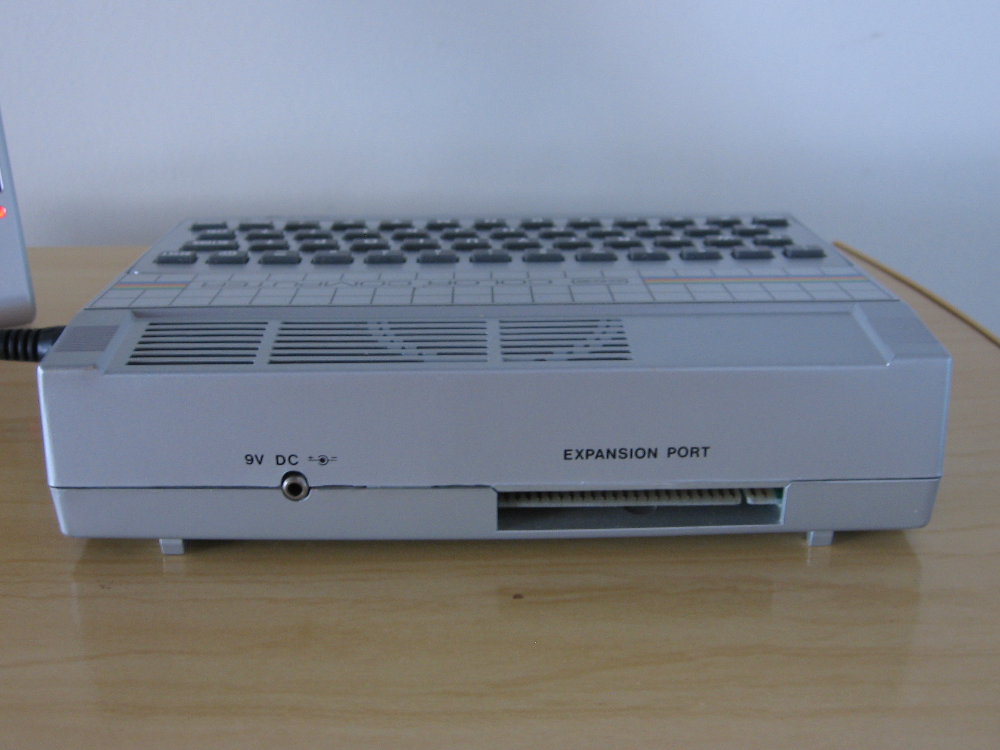

# Porta de expansão

Pinagem do conector (macho) da porta de expansão do MC1000:

| Baixo | Cima |
| ----: | :--- |
| ~RD = 26 | 25 = ~IORQ |
| ~WR = 27 | 24 = ~MRQ |
| ~BUSAK = 28 | 23 = ~HALT |
| ~WAIT = 29 | 22 = ~NMI |
| ~BUSRQ = 30 | 21 = ~INT |
| ~RESET = 31 | 20 = D1 |
| ~M1 = 32 | 19 = D0 |
| +9V = 33 | 18 = **~ROMCS** |
| **DSB64** = 34 | 17 = NC |
| NC = 35 | 16 = NC |
| ~RFSH = 36 | 15 = D7 |
| A0 = 37 | 14 = D2 |
| A1 = 38 | 13 = D6 |
| A2 = 39 | 12 = D5 |
| A3 = 40 | 11 = D3 |
| A4 = 41 | 10 = D4 |
| A5 = 42 | 09 = ϕ (CLOCK) |
| A6 = 43 | 08 = A15 |
| A7 = 44 | 07 = A14 |
| **~ROMCE** = 45 | 06 = A13 |
| GND = 46 | 05 = A8 |
| A9 = 47 | 04 = A12 |
| CORTE = 48 | 03 = CORTE |
| A10 = 49 | 02 = A11 |
| GND = 50 | 01 = +5V |

A quase totalidade dos pinos estão conectados ao Z80, mas há três sinais próprios do circuito do MC1000:

*   **DSB64** — Sinal de entrada. Quando alto, suprime a ativação da RAM interna do MC1000. A [expansão de memória EM1000](perifericos) mantém este sinal sempre ativo, para que apenas ela sirva a RAM para o MC1000.
*   **~ROMCS** — Sinal de entrada. Quando alto, suprime a ativação da ROM interna do MC1000. A placa de CP/M (caso exista) usa este sinal para atender o requisito do sistema operacional de que todo o espaço de endereçamento do Z80 deve estar associado a RAM.
*   ~**ROMCE** — Sinal de saída. Quando baixo, informa que a circuitaria interna do MC1000 levou em conta o valor do sinal ~ROMCS, o endereço de memória sendo solicitado e outros detalhes, e concluiu que irá ativar e acessar sua ROM interna. A expansão de memória EM-1000 usa este sinal para abster-se de ativar sua RAM ao mesmo tempo que a ROM interna do MC1000. Por isso o MC1000 com 64KiB de RAM normalmente só consegue usar 48KiB ($0000–$BFFF). Os 16 KiB restantes ($C000–$FFFF) são sobrepostos pela ativação da ROM.

**Nota**: Com a modificação de hardware necessária para utilização do [BlueDrive](bluedrive), o pino 35, originalmente não conectado, passa a oferecer o sinal interno que torna a ROM acessível pelo Z80 em $0000 no momento da inicialização.

Em 01/12/2013, Claudio H. Picolo sugeriu esta forma de fazer um conector para a porta de expansão do MC1000:

1.  Pegue um conector *edge* ("de borda") fêmea, bem estreito, de 50 vias.
2.  Serre as laterais.
