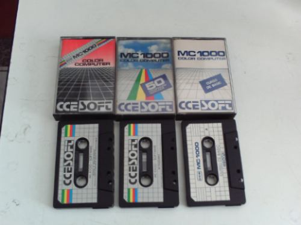

# Software

**Software original**  do MC1000 está disponível em  <https://github.com/ensjo/mc1000-software/tree/master/cce>:

*   ROM
*   Fitas CCESOFT

Programas de outras origens:

*   <https://github.com/ensjo/mc1000-software/tree/master/emerson>  — Programas criados/adaptados/disponibilizados por Emerson Costa (Ensjo).
*   <https://github.com/plainspooky/mc-1000>  — Programas criados/adaptados/disponibilizados por Giovanni Nunes.
*   <https://bitbucket.org/account/user/lst_retro/projects/MC1000>  — Programas criados/adaptados/disponibilizados por Lisias Toledo.