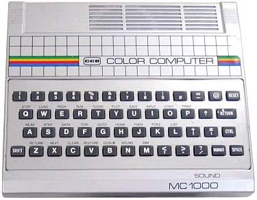
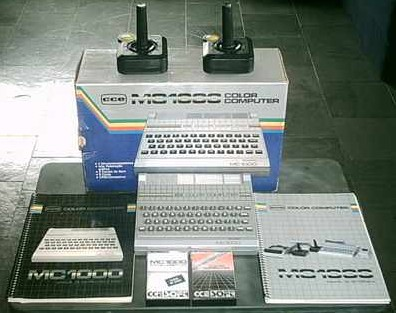
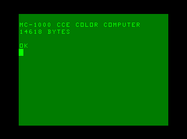
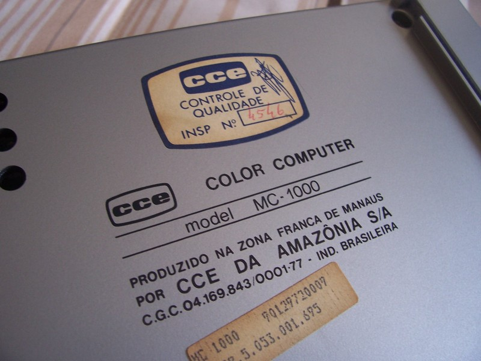
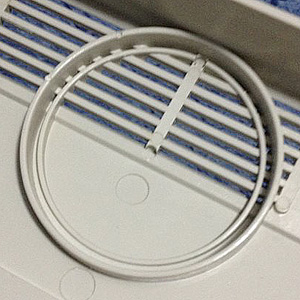

# Trivialidades

## “MC-1000”, “MC 1000” ou “MC1000”?

No gabinete do computador, nos acessórios e nos materiais impressos (caixa, capas dos manuais, rótulos e capas das fitas, propagandas etc.) se lê apenas  **“MC1000”**  — ou **“MC 1000”**, com um quase imperceptível espaço entre as letras e o número.

Apesar disso, lemos  **“MC-1000”**, com hífen, em alguns lugares: na tela de inicialização, em uma “ficha técnica” impressa na base do gabinete, e no texto interno dos manuais.

Entre os  [periféricos](perifericos), a fonte e a expansão de memória estão identificadas sem hífen (**“PS 1000”**  e  **“EM 1000”**). Já no gravador  **“DR-1000A”**  há hífen.

## Tipografia

A  [fonte tipográfica](http://pt.wikipedia.org/wiki/Fonte_tipogr%C3%A1fica) escolhida para a  [identidade visual](http://pt.wikipedia.org/wiki/Identidade_visual) do micro, usada no gabinete do micro e nos materiais impressos é a família  [Microgramma](http://en.wikipedia.org/wiki/Microgramma_(typeface)). No material impresso o nome do micro é geralmente escrito em negrito. No gabinete, o negrito não é usado.

No gabinete e materiais também é usada a fonte  [Helvetica](http://pt.wikipedia.org/wiki/Helvetica). O texto interno dos manuais foi impresso em  [impressora matricial](http://pt.wikipedia.org/wiki/Impressora_matricial). O logotipo da CCESOFT nas  [fitas cassete](software)  usa a fonte  [Stop](http://www.linotype.com/1505/Stop-family.html).

(Quanto ao antigo logotipo da CCE, as fontes mais parecidas que encontrei foram  [YWFT Matter](http://www.youworkforthem.com/font/T0264/ywft-matter) e  [Loft Extra Bold](http://catalog.monotype.com/font/monotype/loft/extra-bold).)

## Por que canal 13?

Na imensa maioria dos videogames, videocassetes e computadores pessoais, quando existe a possibilidade de se conecta-lo à TV via RF (radio frequência), normalmente existem as opções para o canal 3 ou 4 VHF baixo (frequências de 60 MHz a 66 MHz e 66 MHz a 72 MHz, respectivamente). No entanto o MC1000 usa o canal 13 VHF alto (210 MHz a 216 MHz).

Na verdade existiram 2 esquemas elétricos para 2 moduladores de RF diferentes para serem usados no MC1000, um deles mencionava o canal 13 e 211,25MHz como a frequência de portadora para vídeo e 215,75MHz para áudio.

O segundo esquema, chamado de “série B”, foi projetado para operar no canal 3, mas até o presente momento, desconhece-se a existência de um MC1000 que opere no canal 3 e um esquemário da “linha completa de informática” da CCE, publicado pela extinta editora Eltec, sequer menciona o modulador “série B” para o MC1000.

Fora alguma “mística supersticiosa”, não sabemos o motivo de terem optado por essa faixa de frequências diferente do resto do mundo.

## Espaço reservado para alto-falante?

Entre os incontáveis mistérios que envolvem o MC1000, há o curioso espaço reservado para um pequeno alto-falante interno de 2″, exatamente como aconteceu nos primeiros Atari VCS (os dois primeiros modelos de Atari 2600 com “frente de madeira”).

No caso do Atari 2600, havia mesmo a ideia de ter som interno que a Atari deixou de lado, mas no caso do MC1000, o mistério permanece.

## A tecla “@”

A tecla “@” é usada no interpretador BASIC do MC1000 para cancelar a linha sendo digitada no momento. Esse uso remonta ao Altair BASIC (1975), precursor do Microsoft BASIC. Em  [um manual](http://www.virtualaltair.com/virtualaltair.com/PDF/AltairBasic_1275.pdf) se lê (traduzido do inglês):

(pág. 2)

> NOTA: Todos os comandos para o ALTAIR BASIC devem terminar com um retorno de carro. Um retorno de carro diz ao BASIC que você terminou de digitar o comando. Se você cometer um erro de digitação, tecle uma seta à esquerda (←), usualmente shift/O, ou um sublinhado para eliminar o último caracter. O uso repetido de “←” eliminará caracteres anteriores. Uma arroba (@) eliminará toda a linha que você estiver digitando.

(pág. 41)

> @ — Apaga a linha corrente sendo digitada, e imprime um retorno de carro/alimentação de linha. Um “@” usualmente é um shift/P.

## A primeira “foto” da placa-mãe do MC1000

Há muito tempo atrás, nos já remotos anos de 1997 e 1998, Giovanni Nunes e Cesar Cardoso, toparam o projeto de criar uma página sobre os computadores de 8-bit lançados no Brasil, a BR 8-BIT (ou era 8-BIT BR?). Grande parte do material foi compilado a partir das informações das revistas INPUT e Micro Sistemas (principalmente as fotografias). Quando da parte de escrever sobre o MC1000 o Giovanni resolveu acrescentar uma fotografia da  [placa-mãe](hardware)  do computador. Mas como fazê-lo antes da popularização das câmeras digitais? Fácil, usou-se um scanner de mesa! A placa foi cuidadosamente colocada e apoiada sobre o aparelho e digitalizada na maior resolução possível do aparelho. E esta é a explicação da saturação do capacitor próximo ao conector de força e do curioso objeto no canto inferior esquerdo (usado para mantê-la devidamente apoiada, junto com o modulador de RF). Algum tempo depois a página sobre computadores brasileiros passou a ser mantida pelo Daniel Ravazzi que a manteve por alguns anos antes de tirá-la do ar, ela já havia cumprido seu objetivo original. A foto da placa-mãe do MC1000 acabou sendo utilizada em vários outros sítios sobre computadores, inclusive neste aqui.